[主页](https://saga2003.github.io/)   -  [Battlefield](https://saga2003.github.io/battlefield.html)   -   [ARMA](https://saga2003.github.io/arma.html)   -   [SQUAD](https://saga2003.github.io/squad.html)   -   [Rainbow6](https://saga2003.github.io/rainbow6.html)   -   [Racing](https://saga2003.github.io/racing.html)   -   [Others](https://saga2003.github.io/others.html)

# ARMA公开活动展示

## 活动信息
活动时间：2022年03月25日  
活动名：渗透与突袭  

## 任务背景：
2022年3月，俄SSO特种部队渗透乌西部，打击乌运输线与民兵训练营。  
我方阵营：俄SSO特种部队   敌方阵营：乌军、乌民兵、外国雇佣兵  
任务：渗透并突袭目标通信塔，切断敌指挥通信并获得情报。打击物资仓库，打击训练营。  
我方装备与支援：AK-105、RPK-74M、SVD等单兵轻武器。运输载具在安全位置可供使用。3枚伊斯坎德尔导弹。  
敌方装备与支援：本地区乌军、乌民兵、外国雇佣兵，多利用卡车机动，仅配备少量BTR-70。  
## 任务流程：
1. 渗透并突袭目标通信塔，通信塔南北入口各2道哨卡，东西方向有雷区。避开哨卡与雷区，肃清通信塔，获取情报并迅速撤出。  
2. 对目标城镇发起侦查，标定导弹打击目标，分配导弹2枚，杀伤半径100米，到达时间3分钟。优先攻击敌军单位与物资，避免杀伤平民。侦查过程中避免暴露自身。  
3. 根据此前掌握的情报进攻敌训练营，在安全位置获取载具做长距离机动。标定导弹打击目标，分配导弹1枚，在导弹打击过后突击训练营，消灭残余敌军并在15分钟以内迅速撤出。  

## 任务截图

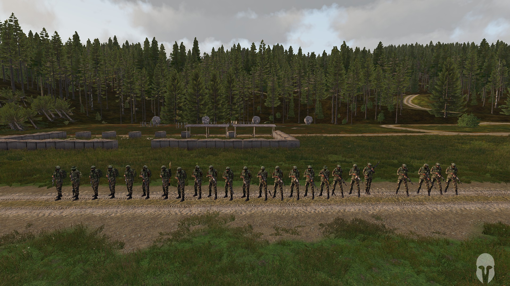  
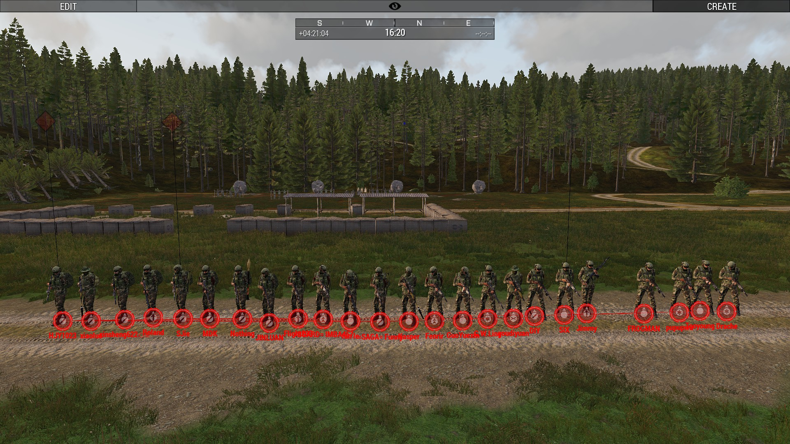  
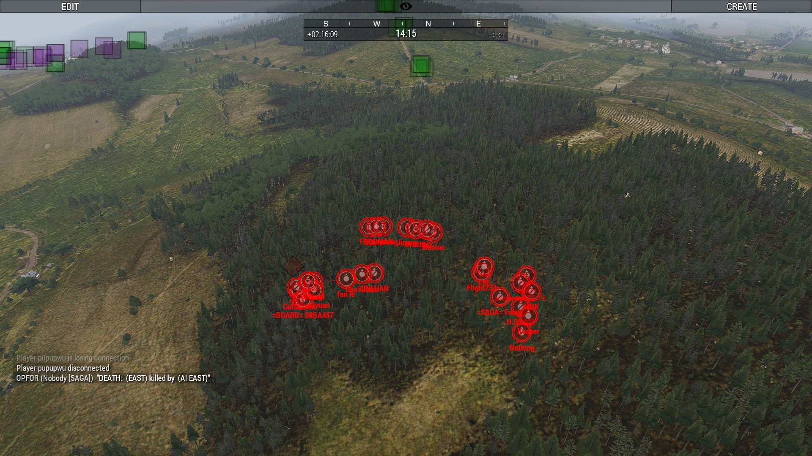  
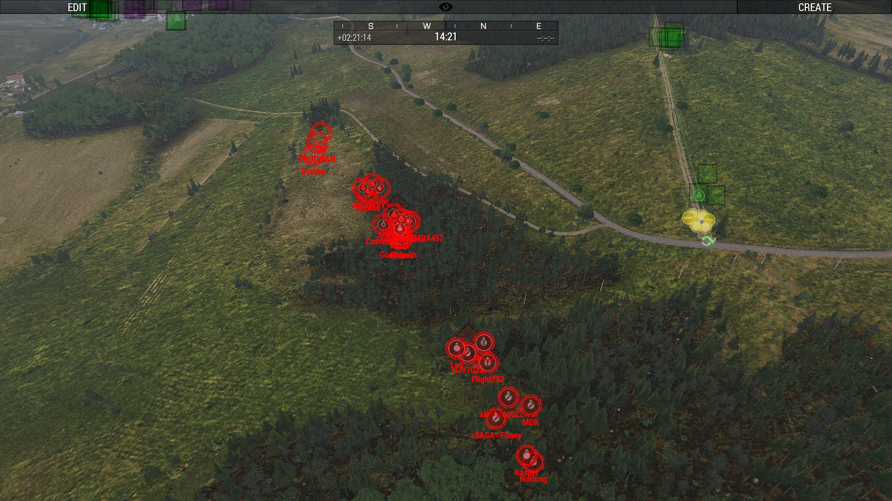  
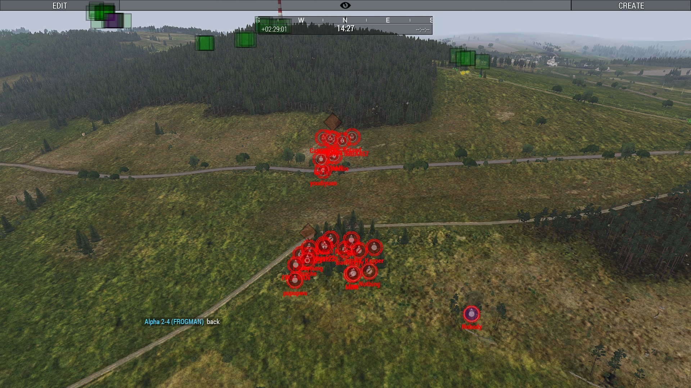  
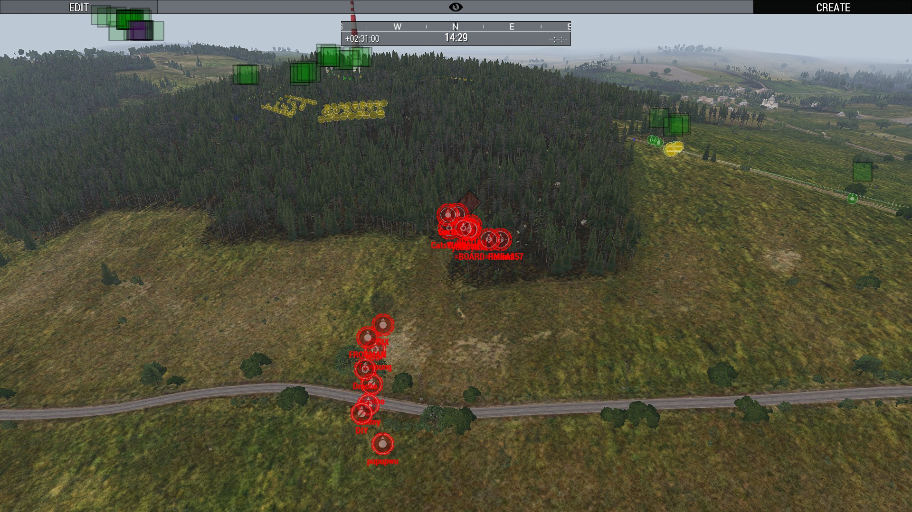  
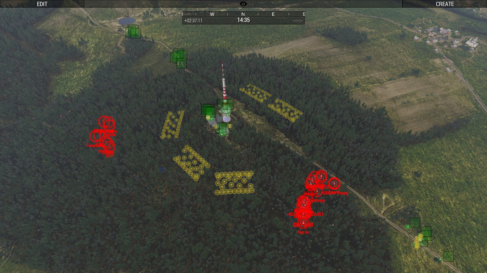  
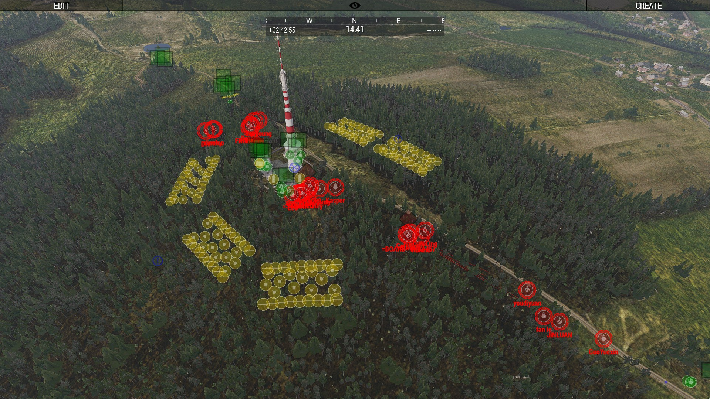  
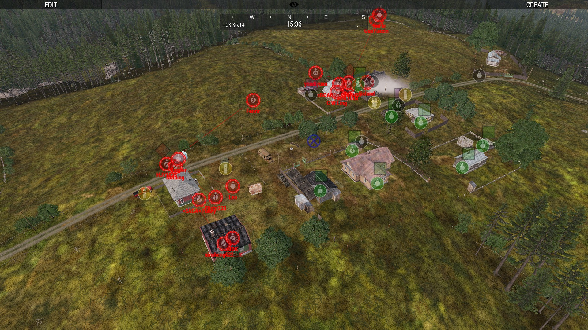
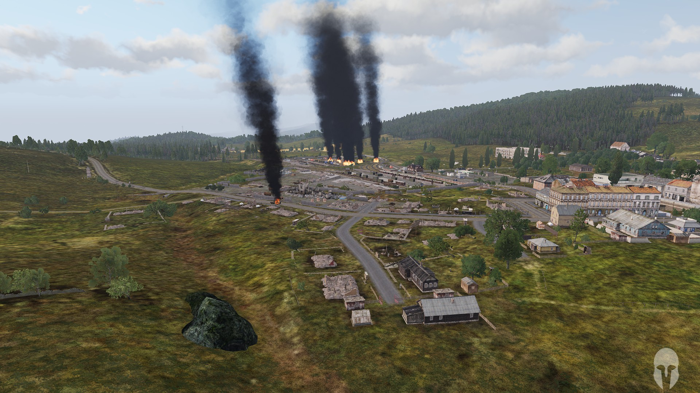  
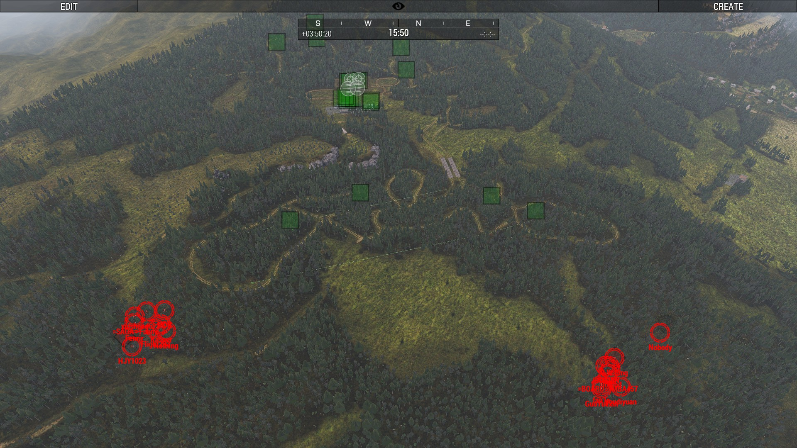    

---
[返回一命制](https://saga2003.github.io/squad.html)
[返回主页](https://saga2003.github.io/)