[主页](https://saga2003.github.io/)   -  [Battlefield](https://saga2003.github.io/battlefield.html)   -   [ARMA](https://saga2003.github.io/arma.html)   -   [SQUAD](https://saga2003.github.io/squad.html)   -   [Rainbow6](https://saga2003.github.io/rainbow6.html)   -   [Racing](https://saga2003.github.io/racing.html)   -   [Others](https://saga2003.github.io/others.html)

# ARMA公开活动展示

## 活动信息
活动时间：2022年03月26日  
活动名： 沙漠风暴

## 任务简报
我们的任务是在GPS和空地一体化打击的优势下穿过沙漠突击敌军防守薄弱的后勤基地，并从侧后方瓦解敌军在机场附近的防线。  
由于我们会从敌人意想不到的地方发动进攻，并且我们的空军会在我们行动之前打击敌军的指挥系统，所以在短时间内敌军不会有成建制的反击和机动部队支援，但是我们仍然需要警惕敌军可能会尝试使用其他手段恢复通信。  

### 任务目标：
1.利用沙尘暴和GPS通过敌军防守薄弱的沙漠，并且占领位于红旗A点的敌军后勤基地。  
2.从侧后方摧毁敌军用于防御机场的红旗B1,B2,B3防线。  
3.占领位于红旗C点的机场并消灭一切抵抗力量  

### 我军情报：
USA Army2000s  
指挥x1 RTOx1 组长x2 机枪x2 医疗x2 精射x2,步枪不限  
装甲：M113，M2A2 ,M1A1  
### 敌军情报：
伊拉克军方拥有一定数量的BMP-1和T-72，并且在关键地区拥有工事进行防守  

### 特殊规则
由于持续数天沙尘暴导致敌军的索敌能力和协调能力下降，但是一旦沙尘暴结束，训练有素的敌军会逐渐恢复战斗力。  

## 任务截图

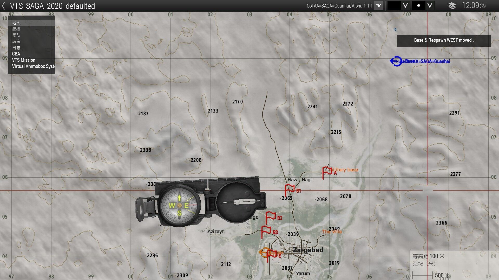  
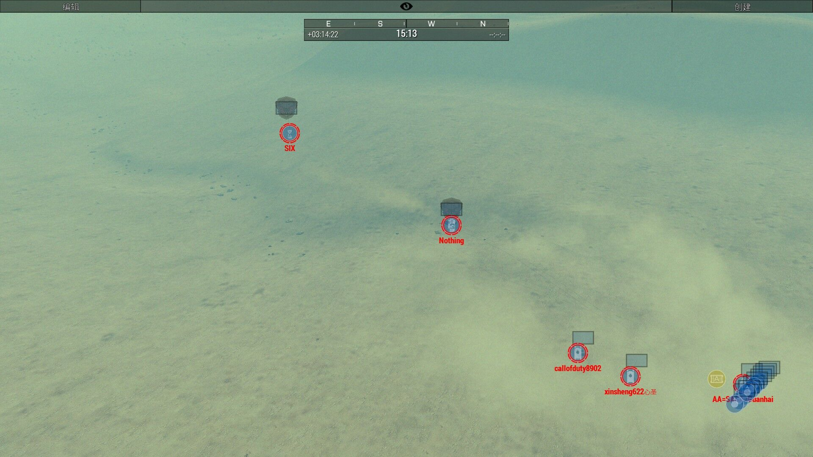  
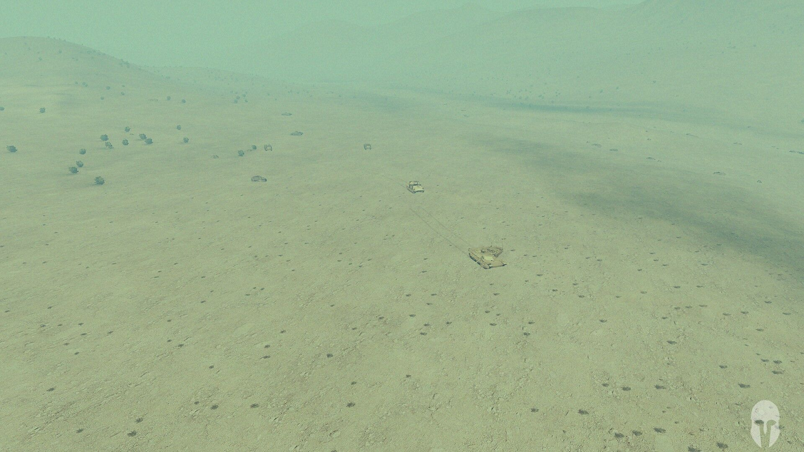  
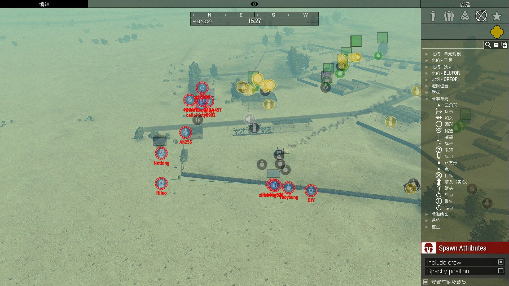  
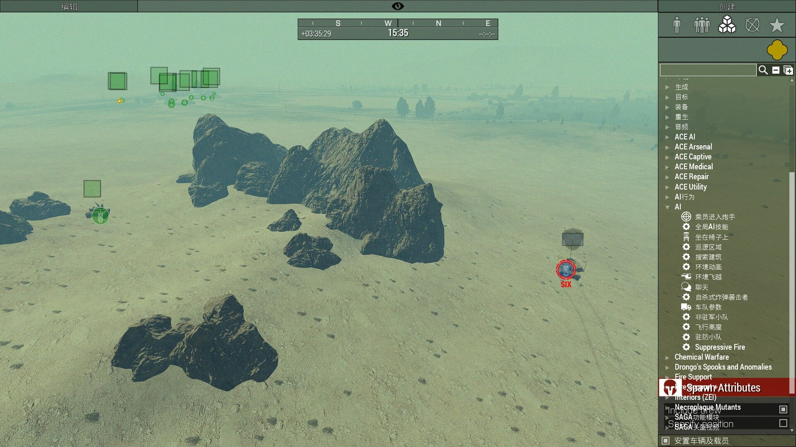  
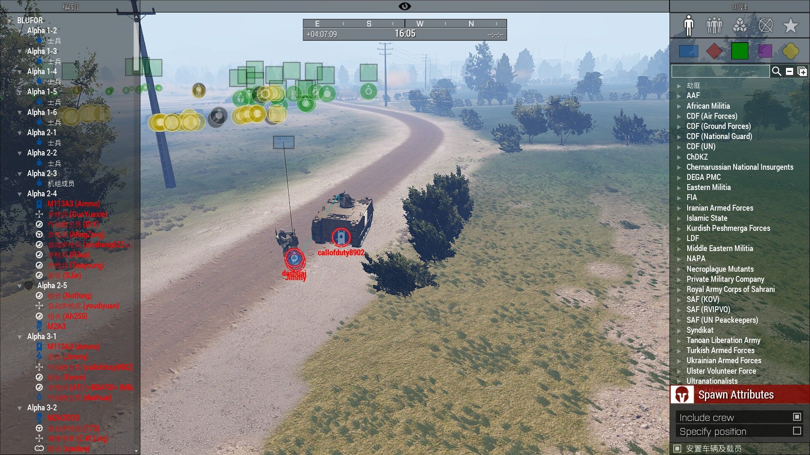  
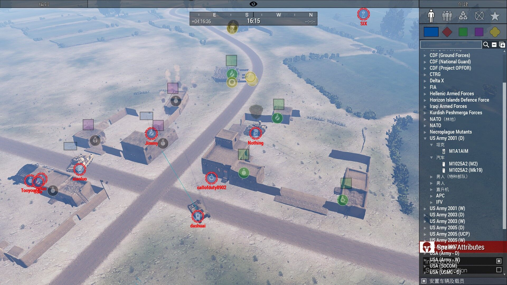  
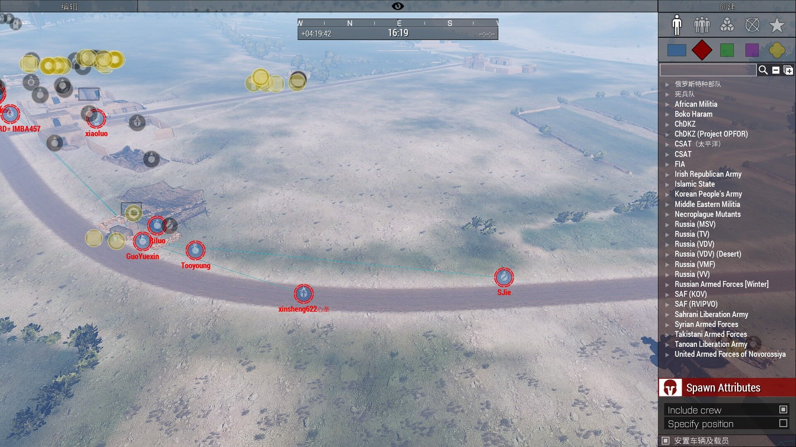  
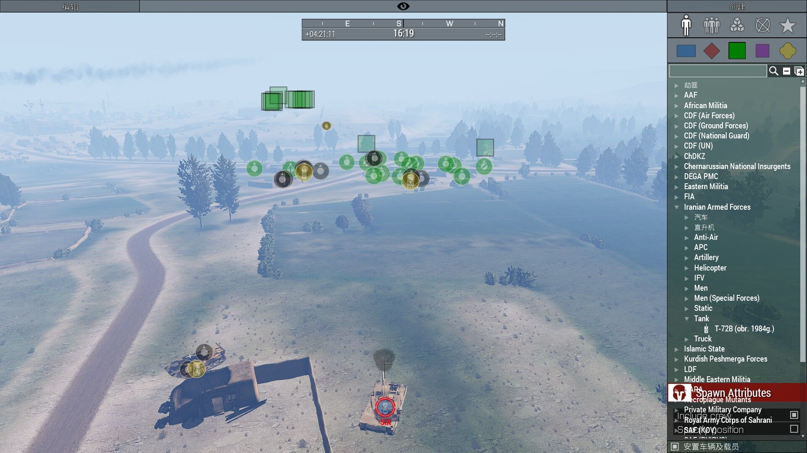  
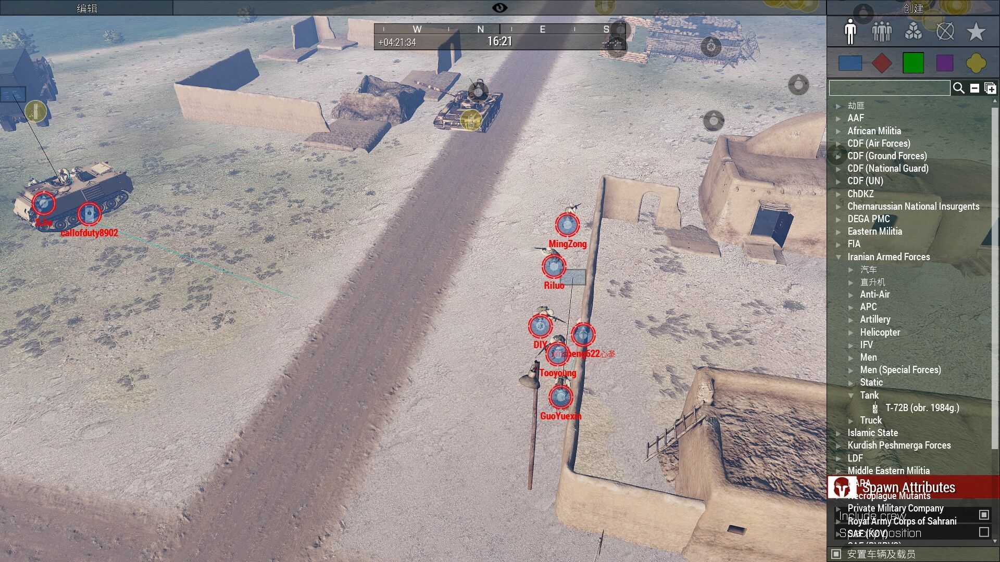  
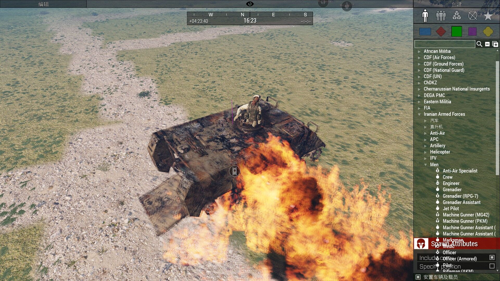  
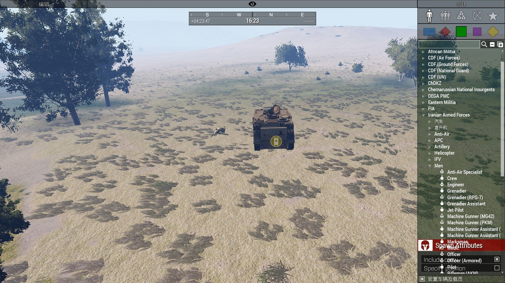  
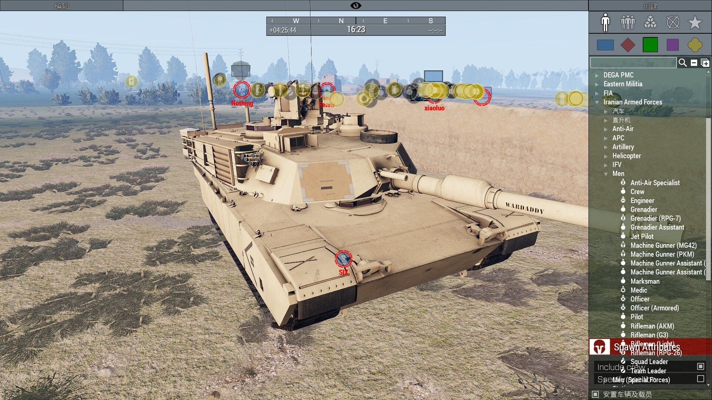  
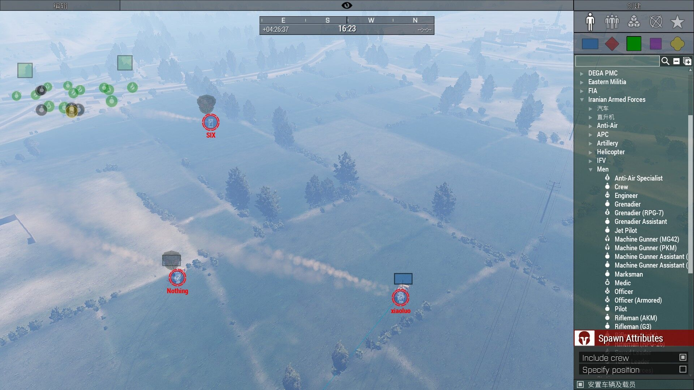  
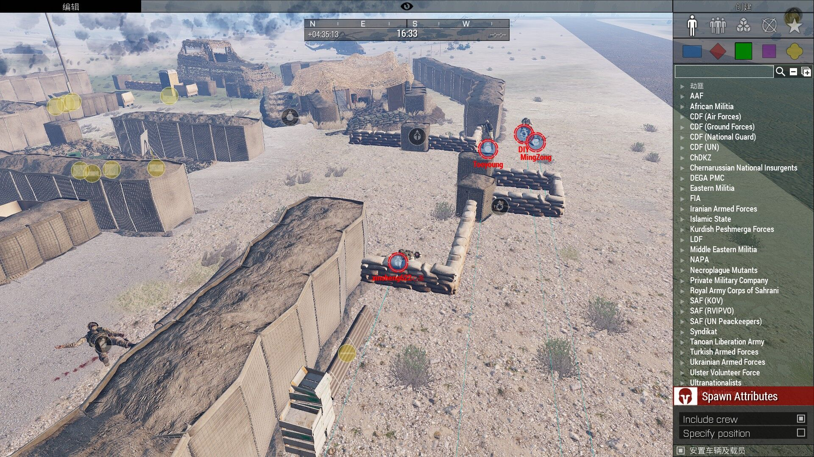  
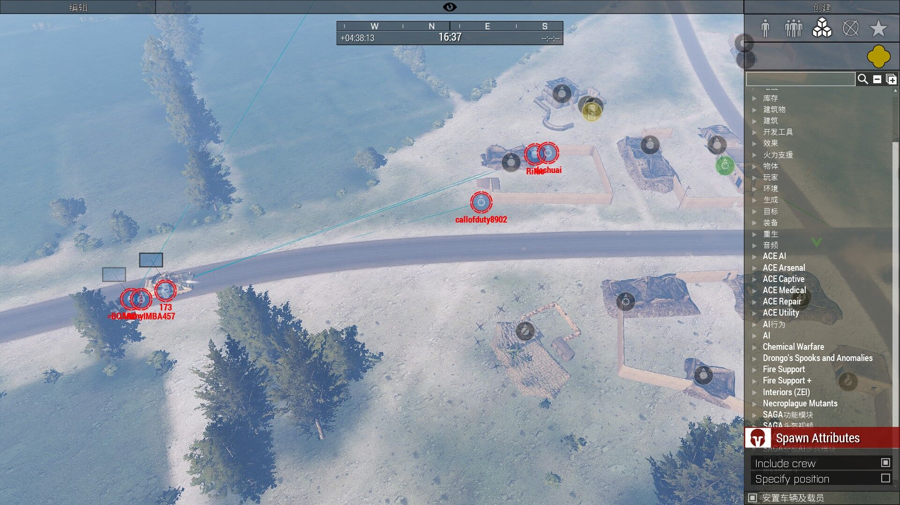  
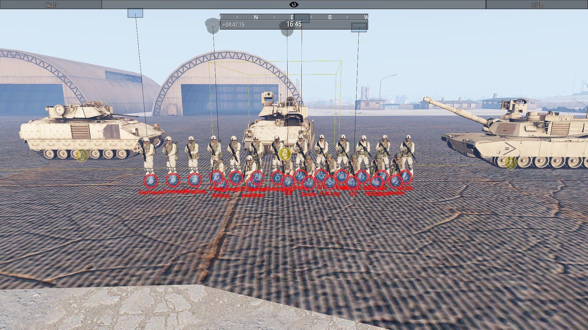  

 

---
[返回ARMA](https://saga2003.github.io/arma.html)
[返回主页](https://saga2003.github.io/)