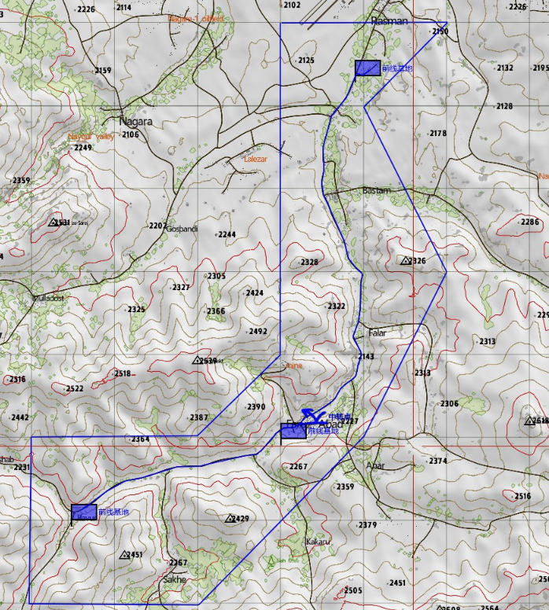

[主页](https://saga2003.github.io/)   -  [Battlefield](https://saga2003.github.io/battlefield.html)   -   [ARMA](https://saga2003.github.io/arma.html)   -   [SQUAD](https://saga2003.github.io/squad.html)   -   [Rainbow6](https://saga2003.github.io/rainbow6.html)   -   [Racing](https://saga2003.github.io/racing.html)   -   [Others](https://saga2003.github.io/others.html)

# ARMA公开活动展示

## 活动信息
活动时间：2022年03月27日  
活动名： *娱乐活动*

## 任务简报
播散花种-播散花种到世界各处，让血色之花盛开在世间  
花种计划已经在塔吉克斯坦完成了大部，政府军需要护送最后一批物资到达中转点，完成最后一块拼图。  
### 敌军情况：
亲俄武装  
连级战斗群、无装甲力量、无仝中力量  
### 友军：
政府军  
班长、组长（榴弹）、机枪、步枪、A一29地面引导  
1. 基地整装
2. 护送物资到中转点
3. 到达前线基地完成任务

  

---
[返回ARMA](https://saga2003.github.io/arma.html)
[返回主页](https://saga2003.github.io/)