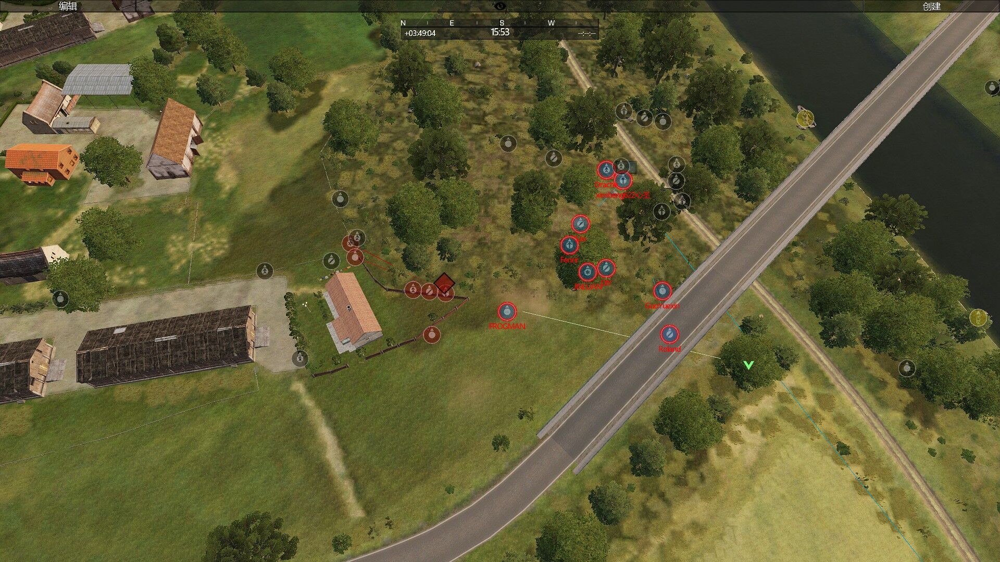
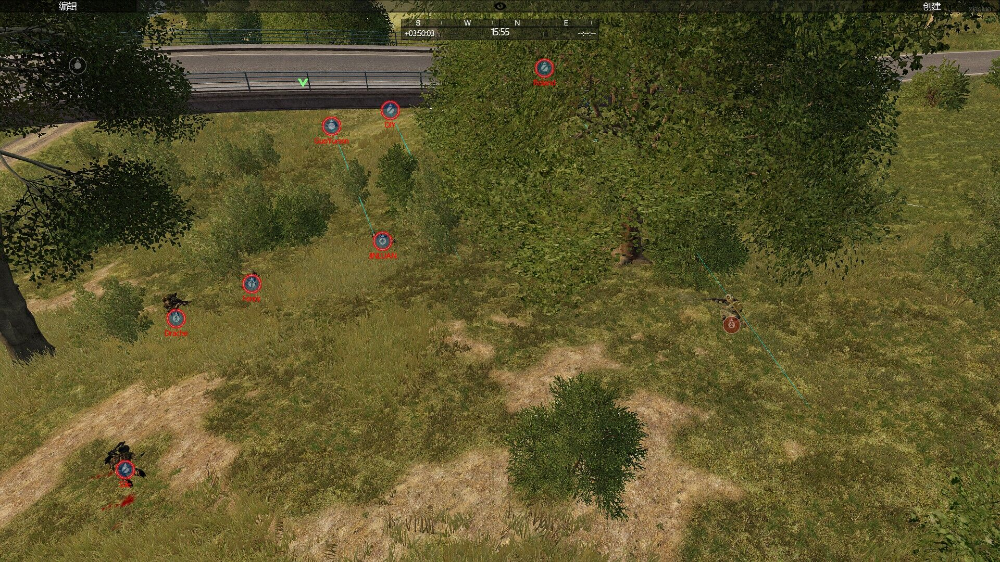

[主页](https://saga2003.github.io/)   -  [Battlefield](https://saga2003.github.io/battlefield.html)   -   [ARMA](https://saga2003.github.io/arma.html)   -   [SQUAD](https://saga2003.github.io/squad.html)   -   [Rainbow6](https://saga2003.github.io/rainbow6.html)   -   [Racing](https://saga2003.github.io/racing.html)   -   [Others](https://saga2003.github.io/others.html)

# ARMA公开活动展示

## 活动信息
活动时间：2022年03月29日  
活动名： 

## 任务简报
### 任务时间与地点:
20220329，0800，Rosche   
### 任务目标:
击溃敌军，夺回机场，解围友军
### 天气预报:
晴，未来一段时间内天气不变
### 任务背景:
敌军对我们发动了偷袭，分割包围了我方边境机场和驻军，友军会从其他方向进攻
### 人员分配:
排长:1、  
副排长:1、  
JTAC/FO:1、  
医疗兵:1、  
通机:1、  
通机助手:1  
班长:1、  
组长:1、  
反坦克兵:1、   
班机:1、  
步枪兵:N、  
精确射手:1    
车组成员:2-3、 
机组成员:2   
### 装备分配:
IFV-Puma、AH-Tiger、MRAP、Truck
  

## 任务截图
  
  
  
  
  
  
  
  
  
  
  
  

---
[返回一命制](https://saga2003.github.io/squad.html)
[返回主页](https://saga2003.github.io/)