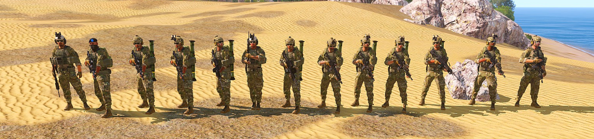

[主页](https://saga2003.github.io/)   -  [Battlefield](https://saga2003.github.io/battlefield.html)   -   [ARMA](https://saga2003.github.io/arma.html)   -   [SQUAD](https://saga2003.github.io/squad.html)   -   [Rainbow6](https://saga2003.github.io/rainbow6.html)   -   [Racing](https://saga2003.github.io/racing.html)   -   [Others](https://saga2003.github.io/others.html)

# ARMA公开活动展示

## 活动信息
活动时间：2022年03月31日  
活动名： 迅猛攻势

## 任务简报
### 背景：
广协联盟与北约彻底交恶，美军需要控制马尔登岛屿最后一座在LDF控制之下的城市。  
### 敌方情况：LDF  
1个加强连（步兵、机枪）、2辆IFV  
防空阵地已压制、火炮阵地陷入痪、装甲车辆大部分停止运作、仝军几乎损失殆尽  
营地间节点间完全丧失通信能力  
区域内无平民  
### 我方情况：美军2035
指挥组（指挥员、副指挥、医疗、无人机操作员）  
步兵班（班长、2组长（榴弹）、2机枪、4步枪）  
梅卡瓦坦克车组  
数枚巡航导弹支暖  
### 流程：
1. 从前进基地出发，沿公路由北向南肃清沿线肝抗力量  
2. 占领敌补给营地、头炮营地、装甲营地  
3. 攻占政府大楼，抓捕敌高级首脑  
4. 全体撤离航母编队附近等待点  

   

## 任务截图
  
  
  
  
  

---
[返回ARMA](https://saga2003.github.io/arma.html)
[返回主页](https://saga2003.github.io/)