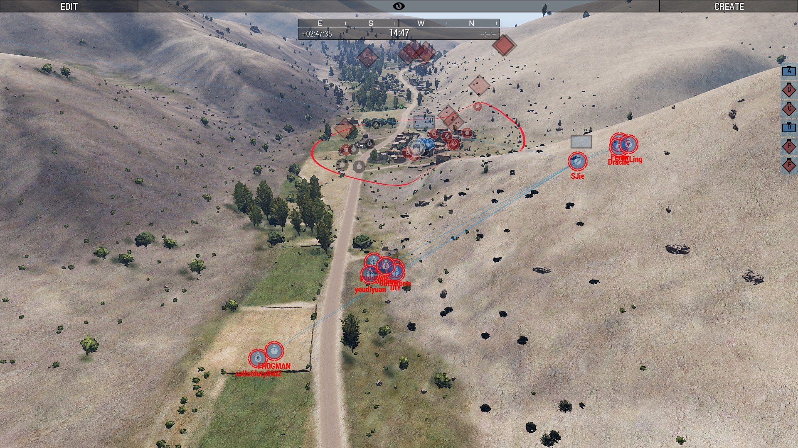

[主页](https://saga2003.github.io/)   -  [Battlefield](https://saga2003.github.io/battlefield.html)   -   [ARMA](https://saga2003.github.io/arma.html)   -   [SQUAD](https://saga2003.github.io/squad.html)   -   [Rainbow6](https://saga2003.github.io/rainbow6.html)   -   [Racing](https://saga2003.github.io/racing.html)   -   [Others](https://saga2003.github.io/others.html)

# ARMA公开活动展示

## 活动信息
活动时间：2022年04月01日  
活动名： 你得靠你自己

## 任务简报
### 背景：
美军加紧撤离，塔利班攻城略地，阿政府军独木难支。“再帮他们一把，或许这是最后一次，就当是为我们自己。”——美陆军某上校（虚构剧情，如有雷同肯定是你搞错了）  
### 我方阵营：
USA-Army  敌方阵营：塔利班  友方阵营：阿政府军
任务：解救被围困的阿军警部队，反击塔利班。玩家分两组竞速+最后汇合进攻。  
### 我方武器与支援：
陆军轻步兵，可得到排的M240、M3古斯塔夫无坐力炮、医护兵加强。两支分队各配1架UH-60M黑鹰。  
### 敌方武器与支援：
苏制单兵轻武器，包括PKM与RPG-7，机枪武装车辆，战场远端可能有搭载火箭巢的武装车辆。敌方存在穿袍子的一般部队以及着迷彩服装具的精锐部队。  
### 友方武器与支援：
美制/苏制轻武器混用、武装车辆与卡车，但多已损失  
### 任务流程：
两支分队人数均等，分别从Takistan南北机场出发，解救被围困阿政府军，并沿预定路线发起城镇清扫，约2km，城镇无平民。黑鹰直升机提供人员运送与空中监视与支援。第一阶段两组竞速，人员阵亡会遭遇严重的罚时。   
任意一组完成第一阶段，两组同时组织撤回，准备第二阶段任务，共同进攻目标城镇。   

## 任务截图

    

   
 
    
  
  
  
  
  
  
  
  
  
  
  
  
 

---
[返回ARMA](https://saga2003.github.io/arma.html)
[返回主页](https://saga2003.github.io/)