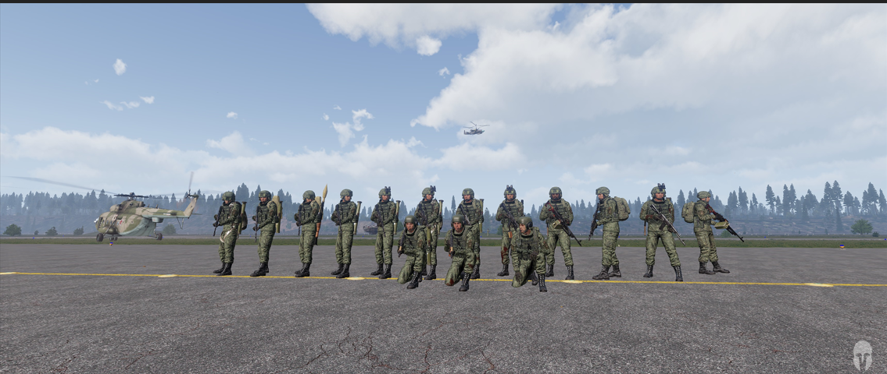

[主页](https://saga2003.github.io/)   -  [Battlefield](https://saga2003.github.io/battlefield.html)   -   [ARMA](https://saga2003.github.io/arma.html)   -   [SQUAD](https://saga2003.github.io/squad.html)   -   [Rainbow6](https://saga2003.github.io/rainbow6.html)   -   [Racing](https://saga2003.github.io/racing.html)   -   [Others](https://saga2003.github.io/others.html)

# ARMA公开活动展示

## 活动信息
活动时间：2022年04月02日  
活动名： 戈斯托梅利机场争夺（改编）

## 任务简报

24日晚7时，俄军陆航编队通过低空突防已经进入戈斯托梅利机场，并与在机场的乌守军进行激烈的交战，于此同时俄军摸清楚了戈斯托梅利机场防控薄弱的情况，并派出了VDV空降部队进行机场争夺。

任务目标：争夺机场并防御，等待地面装甲部队接管。

敌军：乌克兰守军。

## 任务截图

    

 

---
[返回ARMA](https://saga2003.github.io/arma.html)
[返回主页](https://saga2003.github.io/)