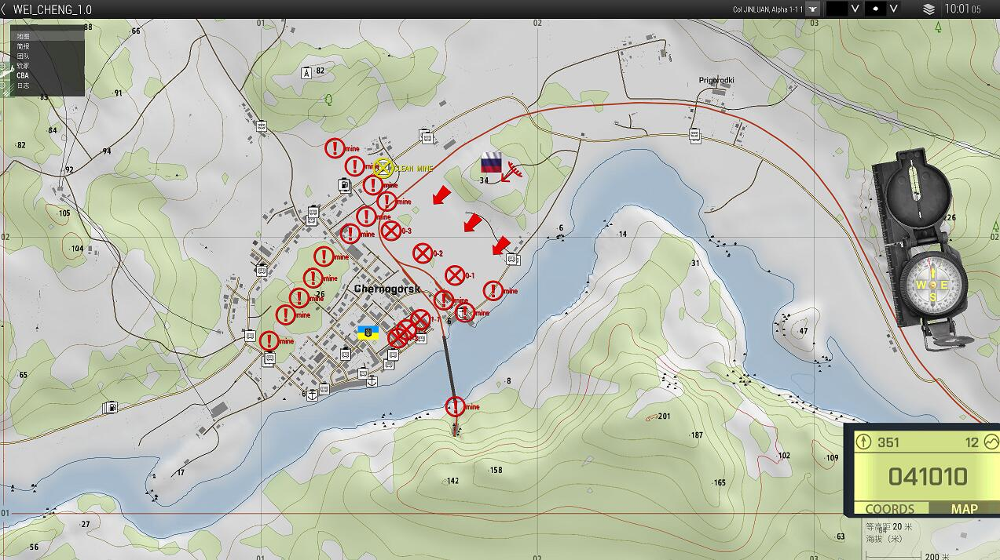
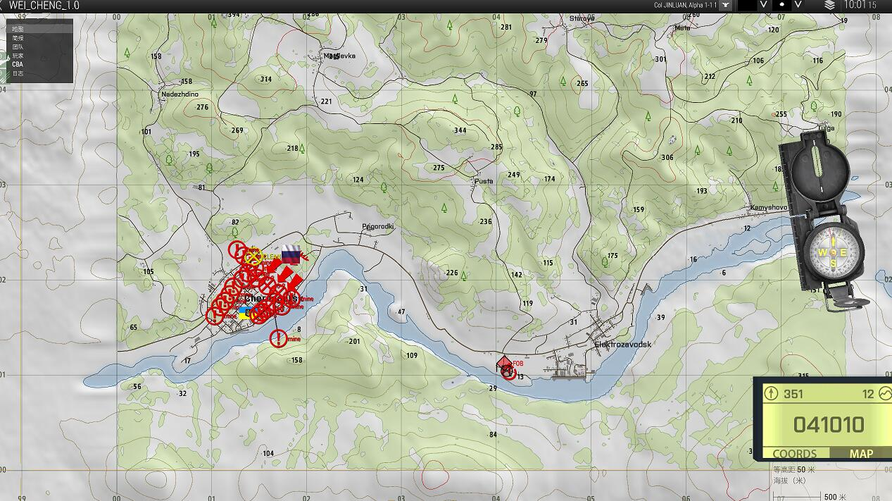
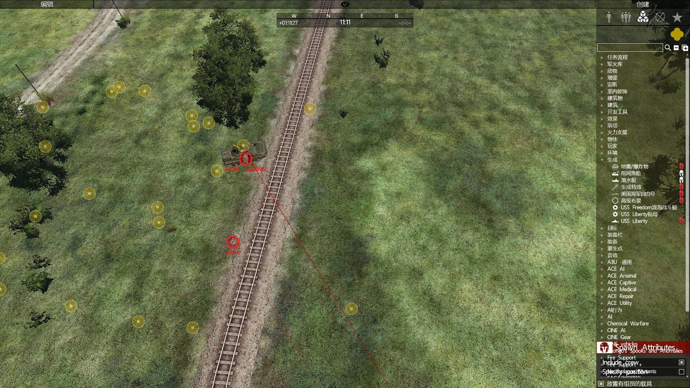
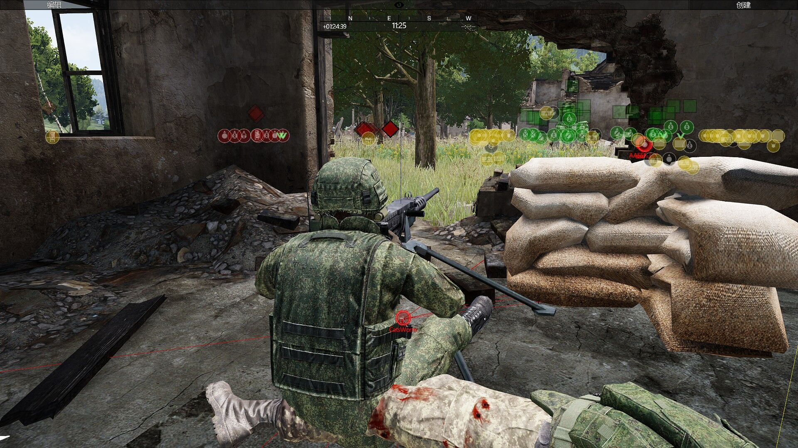
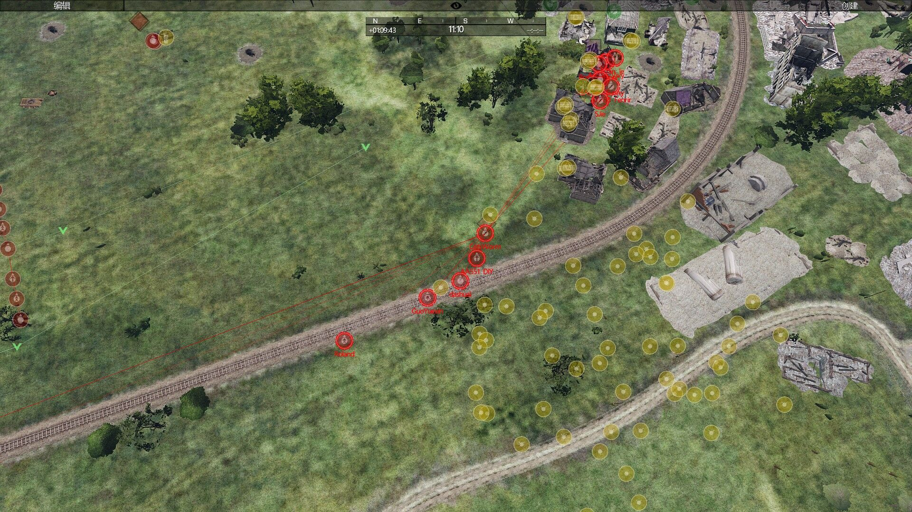
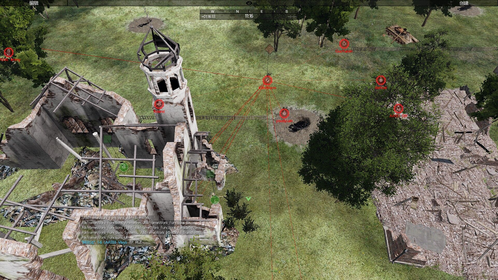

[主页](https://saga2003.github.io/)   -  [Battlefield](https://saga2003.github.io/battlefield.html)   -   [ARMA](https://saga2003.github.io/arma.html)   -   [SQUAD](https://saga2003.github.io/squad.html)   -   [Rainbow6](https://saga2003.github.io/rainbow6.html)   -   [Racing](https://saga2003.github.io/racing.html)   -   [Others](https://saga2003.github.io/others.html)

# ARMA公开活动展示

## 活动信息
活动时间：2022年04月05日  
活动名： 血肉磨盘1.0

在经过激烈的交战后目前俄军已经将乌军主力压缩进入城镇内，乌军在城镇北侧的主要公路附近埋设大量地雷迟滞我方机械化部队的推进速度。  

俄军在对于城镇东侧的郊区城镇进行前期的火力压制后发现效果不佳，遂派遣侦察部队通过东侧34高地对残骸建筑群进行夺取，但在此期间我方前期侦察部队在进攻过程中遭遇废墟内躲藏的乌军单兵反坦克火力的袭击，在进攻受阻后指挥部决定重组机械化步兵连对于废墟区域进行重新争夺。

任务目标 第一阶段以0-1、0-2、0-3区域为主要争夺目标

第一阶段成功后可选择对于1-1、1-2、1-3的城区标定点进行争夺

我方：俄军BMP-2机械化步兵班

根据前期侦察部队传回的情报，在废墟区域内预计有两个排的乌军正规军，其中接近一半为城镇内征召的当地武装平民

  
  

## 任务截图
  
  
  
  

---
[返回ARMA](https://saga2003.github.io/arma.html)
[返回主页](https://saga2003.github.io/)