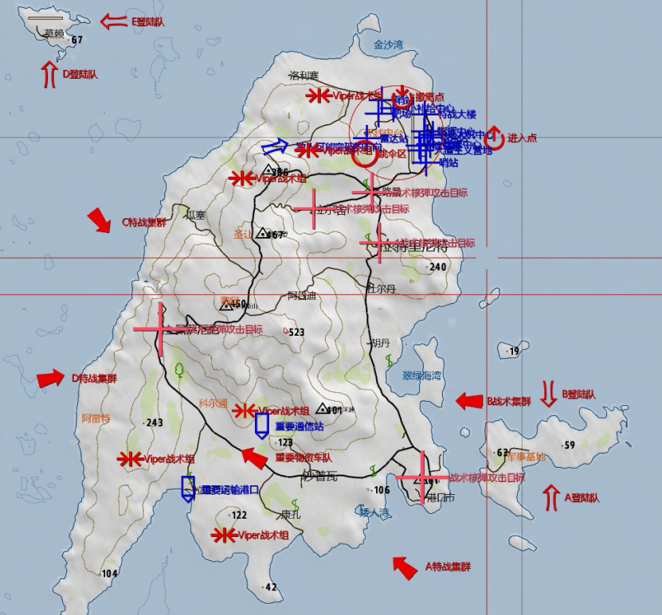
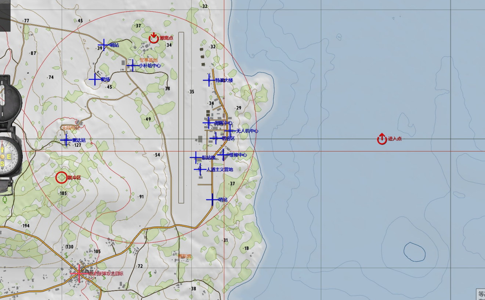
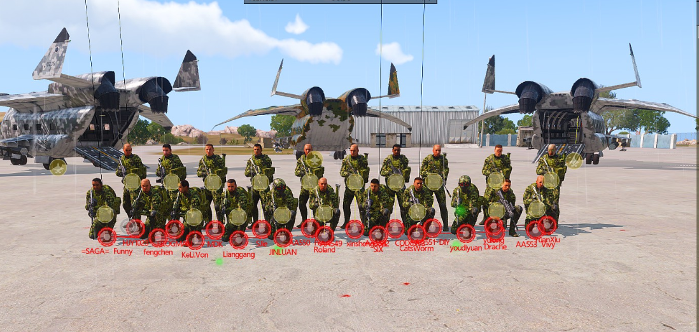
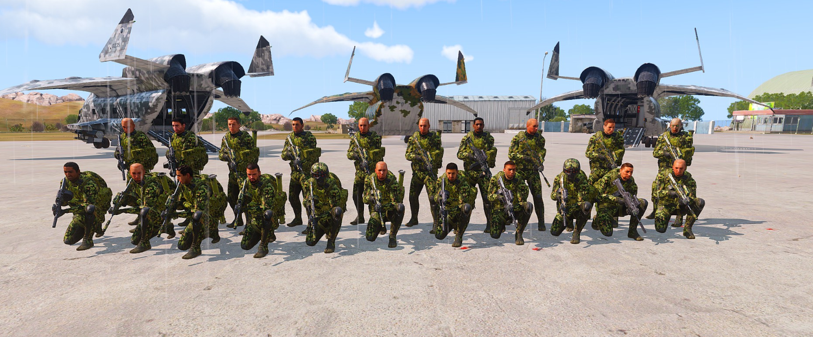

[主页](https://saga2003.github.io/)   -  [Battlefield](https://saga2003.github.io/battlefield.html)   -   [ARMA](https://saga2003.github.io/arma.html)   -   [SQUAD](https://saga2003.github.io/squad.html)   -   [Rainbow6](https://saga2003.github.io/rainbow6.html)   -   [Racing](https://saga2003.github.io/racing.html)   -   [Others](https://saga2003.github.io/others.html)

# ARMA公开活动展示

## 活动信息
活动时间：2022年04月06日  
活动名： 急先锋  

### 背景：
北约与广协联盟彻底交恶，战争已经打响，广协企图在马尔登港口市全歼北约军队。  
与此同时，Viper准备对北约控制下的机场发动突袭，以为全面入侵马尔登做准备。  

敌方：美军  
机场守卫军（140 - 180）  
外围快反（人数未知、装备未知）  
机场装甲、空军均处于修整状态（无作战能力）  

我方：Viper  
指挥组（指挥、轨道炮引导员（副指挥）、医疗兵、无人机操作员（“柏拉格”攻击无人机））  
特战班（班长、2榴弹（组长）、2机枪、4步枪）  
空降组（组长、榴弹、机枪、步枪）  
西安支援、TTS支援  

### 流程：
1. 地面部队从进入点乘坐皮筏艇登陆，控制机场主体
2. 空降部队乘坐西安在雷达站附近跳伞，控制雷达站
3. 肃清占领所有区域后，所有部队前往补给中心等待指挥部指示

  
  

## 任务截图
  
  

---
[返回ARMA](https://saga2003.github.io/arma.html)
[返回主页](https://saga2003.github.io/)