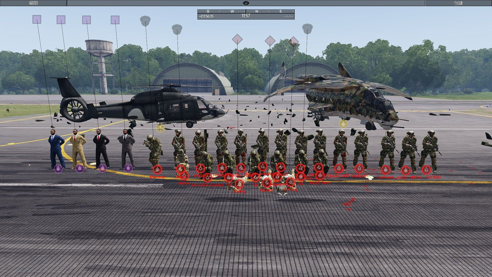

[主页](https://saga2003.github.io/)   -  [Battlefield](https://saga2003.github.io/battlefield.html)   -   [ARMA](https://saga2003.github.io/arma.html)   -   [SQUAD](https://saga2003.github.io/squad.html)   -   [Rainbow6](https://saga2003.github.io/rainbow6.html)   -   [Racing](https://saga2003.github.io/racing.html)   -   [Others](https://saga2003.github.io/others.html)

# ARMA公开活动展示

## 活动信息
活动时间：2022年04月08日  
活动名： 虎门销烟  
地点:Tanoa  

### 任务目标:
1. 与线人汇合获得情报
2. 抓捕HVT
3. 夺取目标物品
4. 摧毁敌对外部势力
5. 营救人质
6. 摧毁敌营地与情报收集

### 任务背景:
我们在太平洋对NATO获得了巨大的胜利，目前我们的盟友、岛国Tanoa已经复国，但由于当局力量不足，Tanoa当地军阀林立，各种犯罪活动层出不穷例如大规模制毒贩毒，更是出现了绑架政府高层人士与社会有名人士的恶劣行径，更有消息称军阀们获得了NATO的支援来进行某项特殊计划……出于对于后方安全的考虑以及盟友的请求，第3师师属ARC支援连与毒蛇太平洋部某组被派遣进入Tanoa帮助政府军稳定局势……

### 人员构成与装备:
飞行员*2-4（执行人员输送、物资载具投送、CAS等任务，合理使用现有空中载具），
1. 排长 x 1，
2. 副排长 x 1，
3. 班长 x 1/SQ，
4. 组长 x 1/SQ，
5. 反坦克兵 x 1/SQ，
6. 医疗兵 x 1/SQ，
7. 精确射手 x 1/SQ，
8. 自动步枪兵 x 1/SQ，
9. 步枪兵 x N，
10. 多用途步枪兵 x 1/SQ，
11. 毒蛇 x 4-6（毒蛇组长、毒蛇反坦克兵、毒蛇医疗兵，毒蛇JTAC，毒蛇爆破专家，毒蛇精确射手），
12. 突击车，
13. 四轮摩托车，
14. 西安，
15. Ka-60等

### 补给补充方式:
空中载具输送，注意控制损失    
### 敌军:
原版辛迪加，以轻步兵为主，拥有一定数量的车载武器与固定武器，无重型载具，疑似受过NATO秘密训练，拥有一定战术水平和游击水平  

### 注意事项:
区域内有少量平民生活，注意区别，尽量减少对于当地住房、基础设施等的附带损伤，敌军随占据大片区域，但敌军绝大多数集中在少数几个任务目标聚集地，其余区域有一些散兵游勇和机动车辆，合理利用手头资源完成任务。  

  
  
  
  
  

## 任务截图
  
  
  
  
  
  
  
  
  
  
  
  
  
  
  

---
[返回ARMA](https://saga2003.github.io/arma.html)
[返回主页](https://saga2003.github.io/)