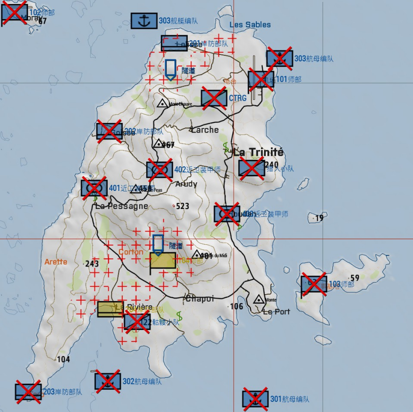
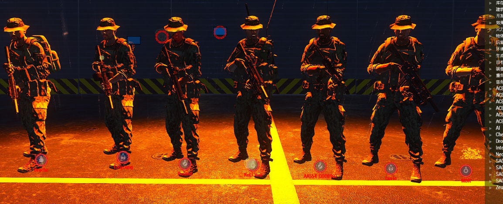

[主页](https://saga2003.github.io/)   -  [Battlefield](https://saga2003.github.io/battlefield.html)   -   [ARMA](https://saga2003.github.io/arma.html)   -   [SQUAD](https://saga2003.github.io/squad.html)   -   [Rainbow6](https://saga2003.github.io/rainbow6.html)   -   [Racing](https://saga2003.github.io/racing.html)   -   [Others](https://saga2003.github.io/others.html)

# ARMA公开活动展示

## 活动信息
活动时间：2022年04月11日  
活动名： 沉默羔羊  

### 背景：
广协联盟全面入侵马尔登，北约正在溃退。。 。

### 敌人:
俄军Viper

### 友军:
美军

指挥组(指挥、无人机操作员)
特战班(班长、2榴弹、2机枪、4步枪)

### 流程:
1. 搜寻生还者  
2. 前往北方撤离  
   
  

## 任务截图
  
  
  
  

---
[返回ARMA](https://saga2003.github.io/arma.html)
[返回主页](https://saga2003.github.io/)