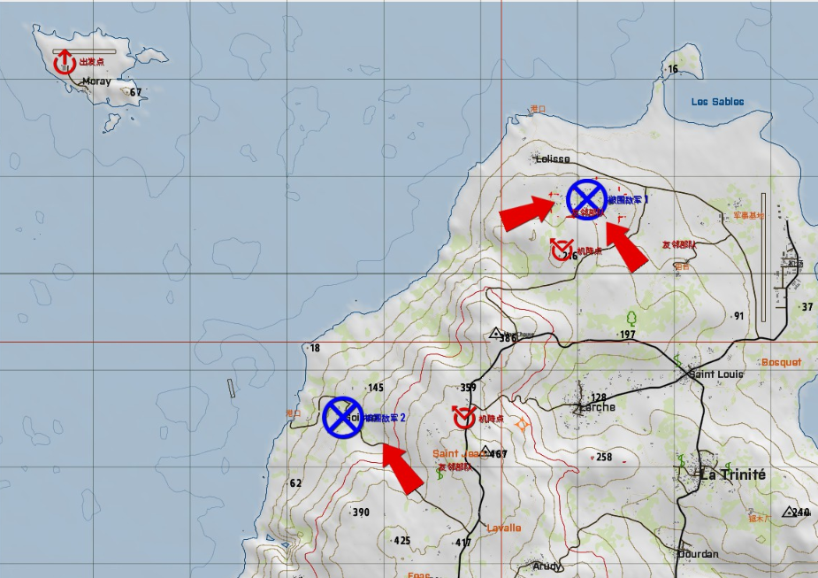
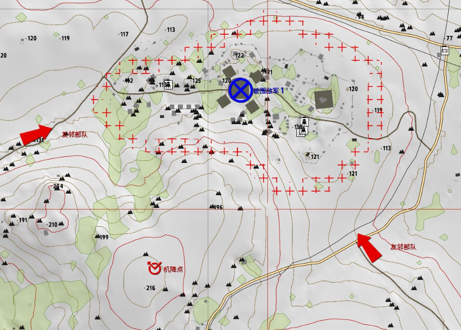
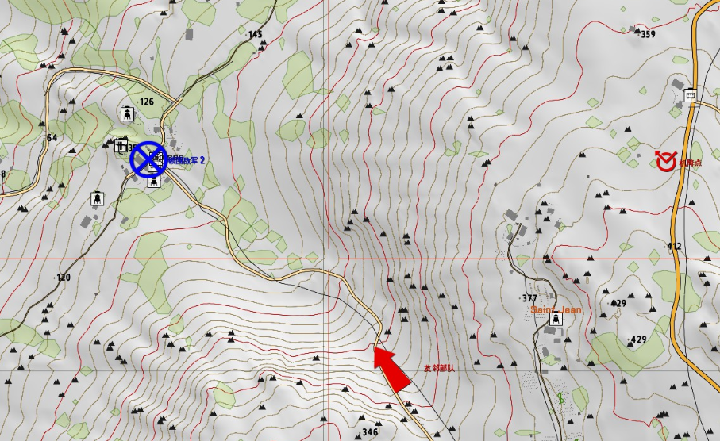
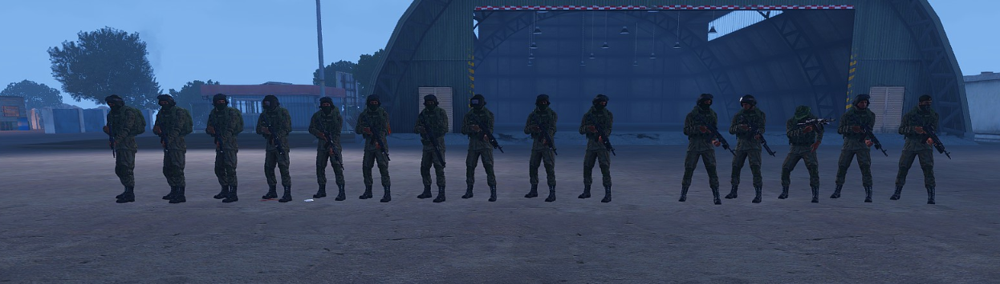
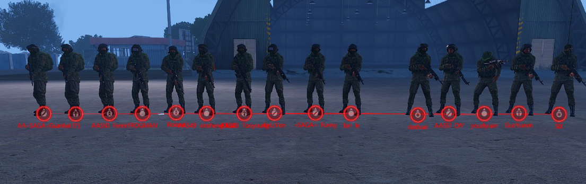
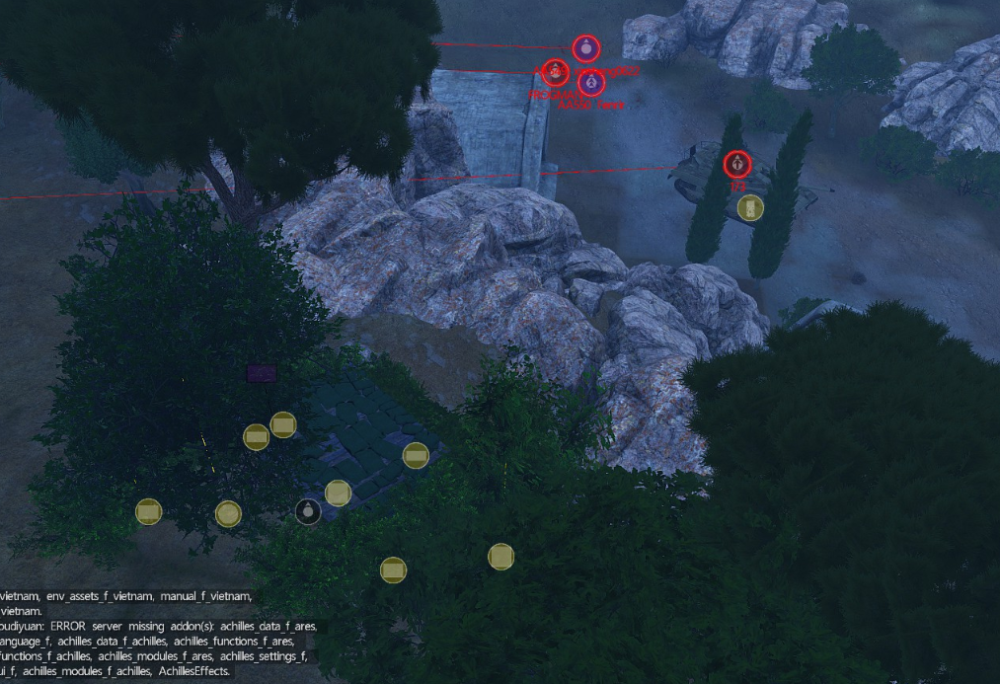

[主页](https://saga2003.github.io/)   -  [Battlefield](https://saga2003.github.io/battlefield.html)   -   [ARMA](https://saga2003.github.io/arma.html)   -   [SQUAD](https://saga2003.github.io/squad.html)   -   [Rainbow6](https://saga2003.github.io/rainbow6.html)   -   [Racing](https://saga2003.github.io/racing.html)   -   [Others](https://saga2003.github.io/others.html)

# ARMA公开活动展示

## 活动信息
活动时间：2022年04月12日  
活动名： 高昂代价  

### 背景：
广协联盟已经控制了马尔登大部分地区，北约的颓势已不可逆转。岛内仍存在少量顽固不化分子，广协联盟需要将其彻底消灭。

### 敌人:
美军
完全丧失制空权、制海权  
失去大部分装甲力量(少量装甲充当固定炮台)步兵编制完全被打乱  

### 友军:
广协联盟  

指挥组(指挥、攻击无人机操作员)  
步兵班(班长、2榴弹、2机枪、1工兵、3步兵)  
M290运输支援、西安支援、T14坦克群支援、2S9重炮群支援(AI操作、指挥部调动)  

### 流程:
1. 肃清被围敌军1  
2. 肃清被围敌军2  
3. 撤离至出发点  
   
  
  
  

## 任务截图
  
  
  
---
[返回ARMA](https://saga2003.github.io/arma.html)
[返回主页](https://saga2003.github.io/)