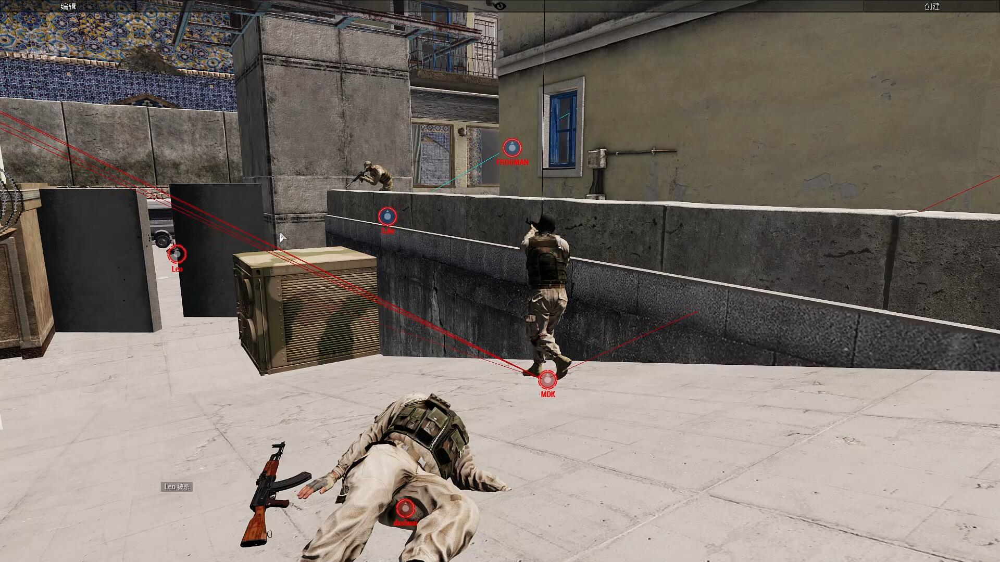

[主页](https://saga2003.github.io/)   -  [Battlefield](https://saga2003.github.io/battlefield.html)   -   [ARMA](https://saga2003.github.io/arma.html)   -   [SQUAD](https://saga2003.github.io/squad.html)   -   [Rainbow6](https://saga2003.github.io/rainbow6.html)   -   [Racing](https://saga2003.github.io/racing.html)   -   [Others](https://saga2003.github.io/others.html)

# ARMA公开活动展示

## 活动信息
活动时间：2022年04月13日  
活动名：反恐行动之沙漠Ⅱ  

### 背景：
一支刚刚抵达前线的美军作战分队接到线报，了解到一伙敌武装分子正尝试炸毁该区域的美军重要军火补给点。碍于后续增援部队抵达仍需较长时间，该作战分队决定就地展开防御部署，抵挡敌军的攻势。  

### 任务性质：
PVP

### 任务玩法:
本任务主要考察玩家小队作战、任务分配、巷战技巧等能力。双方队伍按人数平均分配到美军与武装分子。武装分子持有一个炸药包,需要安放在A、B区域内的特定位置，每次炸药需设定45s的延迟爆炸时间，该时间内，美军可以拆除炸药。A、B两区域任意某一区域的军火补给点被炸毁武装分子小队即可得1分。美军则需要防守两个区域，消灭所有武装分子才能得1分。若武装分子一方长时间内没有进攻目标区域，经提醒后仍拒绝迅速进攻目标区域，则被视为怯战，将被战场监督员就地处决。15局后，双方互换身份。先得16分得队伍获得胜利。  

**其它:其他注意事项由导演现场告知。**

---

## 简报截图   
  
  
  
  

## 任务截图
  
  
  
  
  
  
  
  
  
  
  

---
[返回ARMA](https://saga2003.github.io/arma.html)
[返回主页](https://saga2003.github.io/)