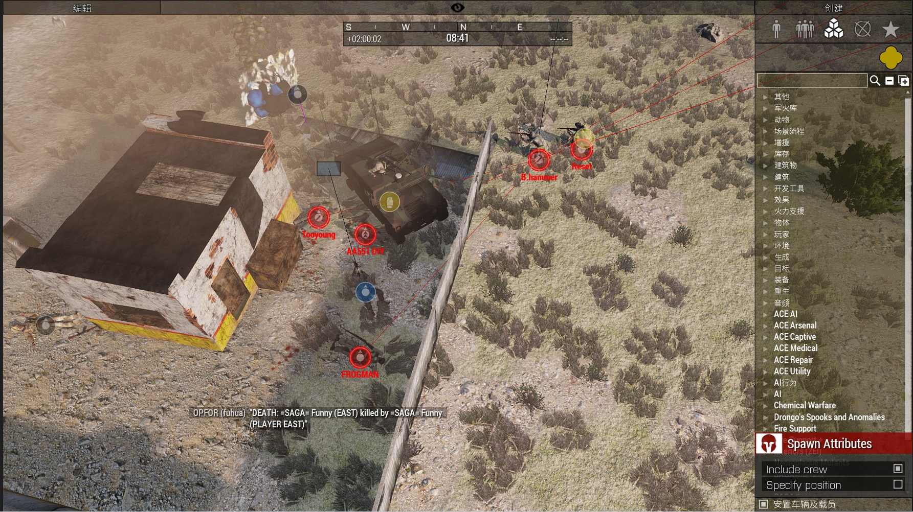

[主页](https://saga2003.github.io/)   -  [Battlefield](https://saga2003.github.io/battlefield.html)   -   [ARMA](https://saga2003.github.io/arma.html)   -   [SQUAD](https://saga2003.github.io/squad.html)   -   [Rainbow6](https://saga2003.github.io/rainbow6.html)   -   [Racing](https://saga2003.github.io/racing.html)   -   [Others](https://saga2003.github.io/others.html)

# ARMA公开活动展示

## 活动信息
活动时间：2022年04月16日  
活动名：水深火热（游击队篇）  

### 背景：
任务时间和地点:2010年-坎大哈  
我们在坎大哈建立了新的政权，赶跑了原来腐败的政府。当我们正在为之庆祝的时候。邪恶的u国带领着对我们露出了它的獠牙。新生的我们无力抵抗，必须隐藏自己寻求帮助。  

### 我方人员:
失败支队下属第一小队我方人员使用武器:AKM,PKM,rpg。  

### 我方载具:
1. 吉普 x 1
2. 卡车 x 3 
3. bmp x 1

### 我方常规任务:
截获、袭扰、破袭等等
**注:我方人员装备会随着缴获而升级。敌方武器不能直接使用。**

### 敌方人员:
以U国为首的多国联军和u国建立的伪政府军。（伪政府军使用苏式装备）  

### 敌方载具和火力:
伪政府军-卡车-吉普-BRDM- BMP1P。  
拥有81mm迫击炮u国联合部队-布拉德利, sck,A-10·

**注意：补充机制为阶段性补充，请谨慎对代自己的所作所为。**

---

## 任务截图
  
  
  
  
  
  
  

---
[返回ARMA](https://saga2003.github.io/arma.html)
[返回主页](https://saga2003.github.io/)