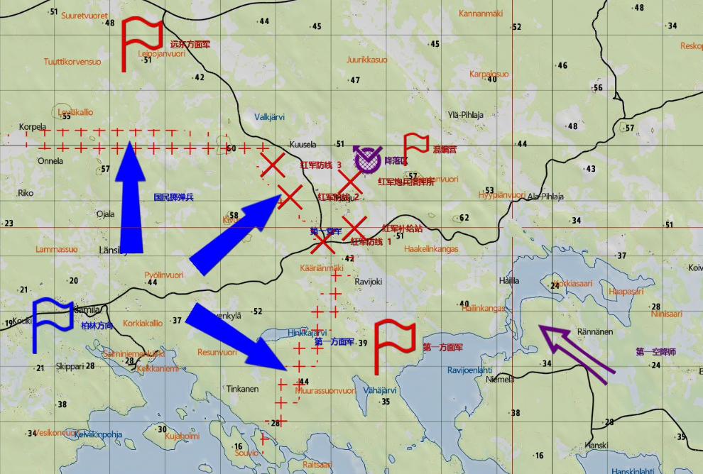
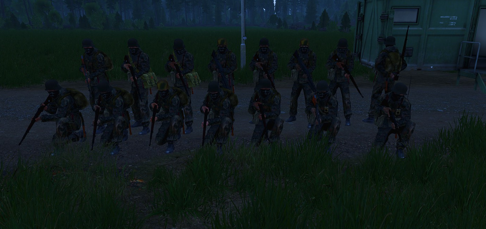
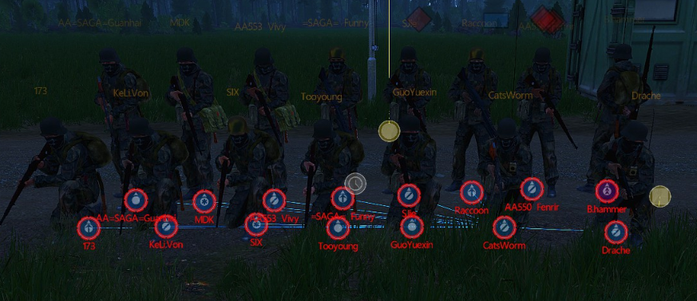

[主页](https://saga2003.github.io/)   -  [Battlefield](https://saga2003.github.io/battlefield.html)   -   [ARMA](https://saga2003.github.io/arma.html)   -   [SQUAD](https://saga2003.github.io/squad.html)   -   [Rainbow6](https://saga2003.github.io/rainbow6.html)   -   [Racing](https://saga2003.github.io/racing.html)   -   [Others](https://saga2003.github.io/others.html)

# ARMA公开活动展示

## 活动信息
活动时间：2022年04月18日  
活动名：为了黑特乐（娱乐任务）

### 背景：
红军即将完成对柏林的包围，德军需要突破红军的封锁线以破坏红军的意图。战士们，德国虽大，但我们身后就是柏林，为了祖国献出你们的热血与生命。  

### 敌方:红军  
加强连、数辆T-34-85  

### 我方:德军
指挥组（指挥员、督战员）  
步兵班（班长、1机枪、1机枪副手、1医疗兵、1爆破手、4步枪）  

### 流程:
1. 空降至区域重新集结
2. 摧毁敌军的火炮阵地
3. 配合第—党卫军消灭红军防线1的有生力量
4. 占领防线1防止敌人反扑

### 简报截图
 

---

## 任务截图
  
  

---
[返回ARMA](https://saga2003.github.io/arma.html)
[返回主页](https://saga2003.github.io/)