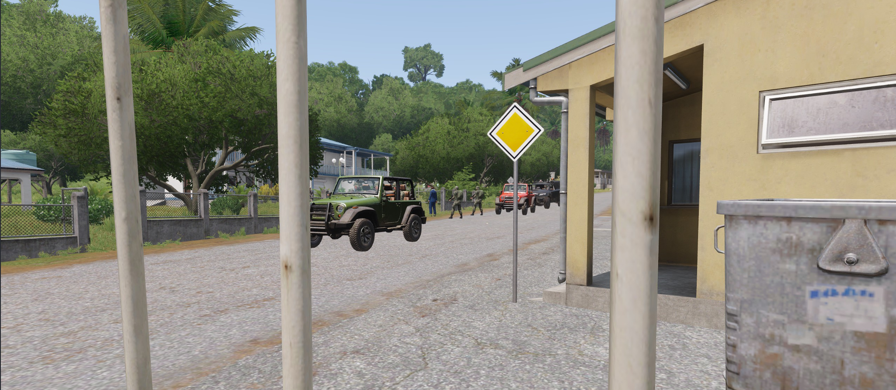

[主页](https://saga2003.github.io/)   -  [Battlefield](https://saga2003.github.io/battlefield.html)   -   [ARMA](https://saga2003.github.io/arma.html)   -   [SQUAD](https://saga2003.github.io/squad.html)   -   [Rainbow6](https://saga2003.github.io/rainbow6.html)   -   [Racing](https://saga2003.github.io/racing.html)   -   [Others](https://saga2003.github.io/others.html)

# ARMA公开活动展示

## 活动信息
活动时间：2022年04月19日  
活动名：无名

## 任务简报

### 任务背景
这座位于两国边境地区的小岛原本默默无名，但在21世纪，一切都有可能，对于普通人来说地狱也不过如此，但对于岛上的毒贩、军阀、恐怖分子、帮派成员、投机者来说，这里就是天堂岛。枪支，毒品，炸药，钞票，你所能想要的一切，在这座岛上都有。但想获得，往往复出的却是死亡的代价，你所在小镇，昨天还是毒枭的销金库，过了一晚，就成了军阀的新基地。每天都有组织被消失，每天也有新的帮派建立。你所能做的，就是赶紧把今天赚的钱花完，明天好不留遗憾，这就是这座岛的生存之道。

据线报，哥伦比亚最有钱，也是DEA目前赏金最高的毒枭卢比奥离开了他的老巢，来到这座小岛。尽管困难丛丛，但这是我们的唯一机会。今天的任务就是把他抓捕归案。  

### 任务目标：
1. 登岛，前往指定地点，消灭目标保镖，抓捕目标。
2. 确认身份后，将目标带回出发地。

### 我军情况：
PMC ,指挥 x 1(每班)，班机 x 1(每班)，榴弹 x 1(每班)，步枪 x N  

### 敌军情况：
以轻步兵为主，拥有一定数量的车载武器与固定武器，无重型载具，  

### 注意事项:
1. 任务目标必须存活，若目标死亡，任务失败。
2. 岛内有平民生活，注意区别。
3. 岛内非任务地区部队为中立状态，不得主动攻击中立部队。

**本次任务集体进入蓝方，挂载最新公开任务和地图包**

### 简报截图
 

---
[返回ARMA](https://saga2003.github.io/arma.html)
[返回主页](https://saga2003.github.io/)