[主页](https://saga2003.github.io/)   -  [Battlefield](https://saga2003.github.io/battlefield.html)   -   [ARMA](https://saga2003.github.io/arma.html)   -   [SQUAD](https://saga2003.github.io/squad.html)   -   [Rainbow6](https://saga2003.github.io/rainbow6.html)   -   [Racing](https://saga2003.github.io/racing.html)   -   [Others](https://saga2003.github.io/others.html)

# ARMA公开活动展示

## 活动信息
活动时间：2022年04月20日  
活动名：恶魔之邀
导演：=SAGA=xiaoluo 小落

## 任务简报

### 任务背景

C一130于P岛坠毁，机组成员遭到迫害，P岛武装对美军发起死亡邀请。  
美军一支航母编队正在迅速向P岛靠近，力图消灭P岛所有武装力量。  
### 详细背景：
美军C一130在执行日常任务时于P岛不幸坠落。  

机组成员于坠机后，与指挥部立刻取得了联系，亻日涌信仅持续了几秒。  

凭借仅有的坠落坐标，一支搜寻小队被派出，搜寻结果表明，C一130主体完整，但未发现幸存者。  

几天后，几段影像片段在社交网站疯狂传播，诵寸情报部门的分析，该视频中出现人员即为坠机人员。  

视频中大部分机组成吊漕受到非人的待遇，被折致死，幸运的是，可以确定仍有三名机组人员存活。  

同时，施暴者对美军发出死亡邀清，为了捍卫人权，一支航母编队正在向P岛急速靠近。 

### 主要目标：
1. 消灭岛屿有生力量
2. 击毙岛屿高级首脑
3. 营救机组成员

### 简报截图
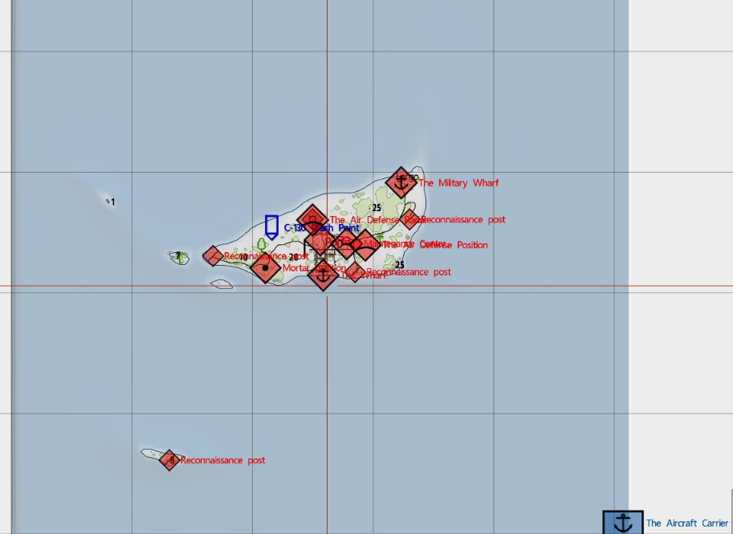   
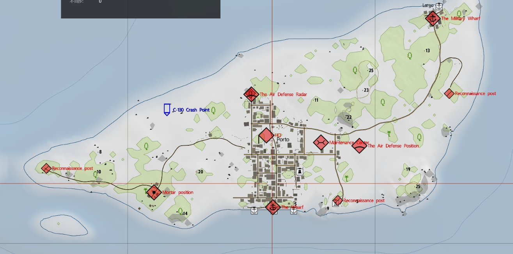   

### 任务截图
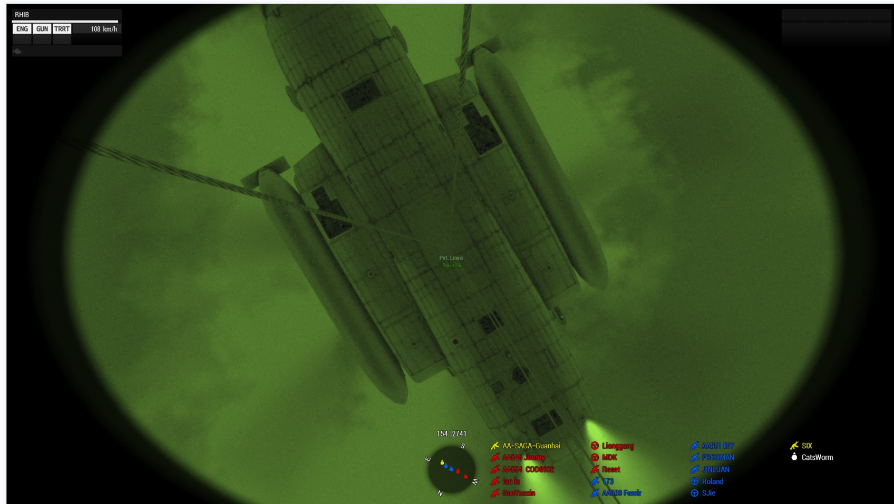   
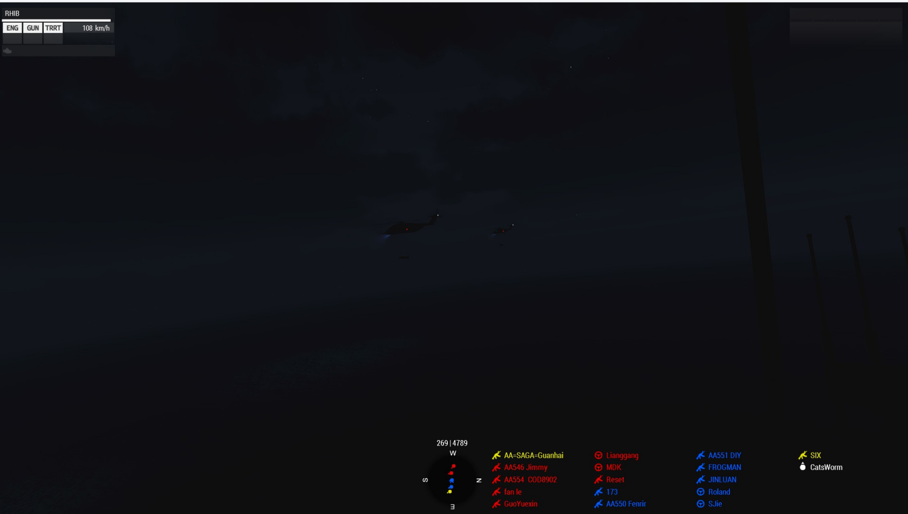   
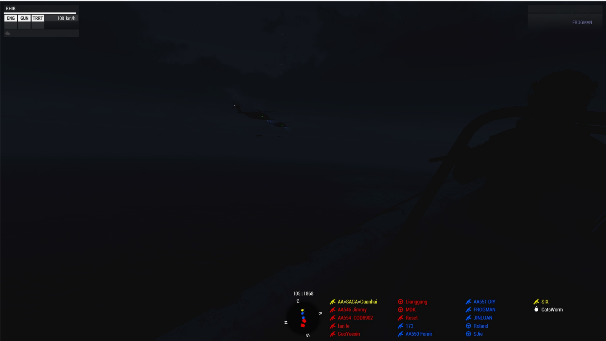   
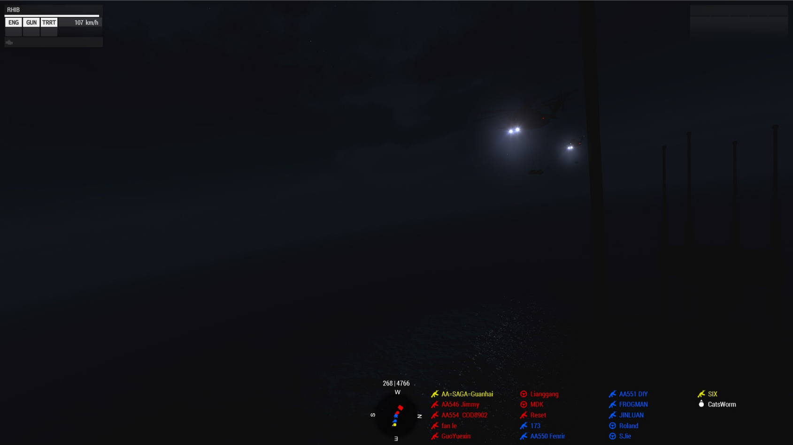   
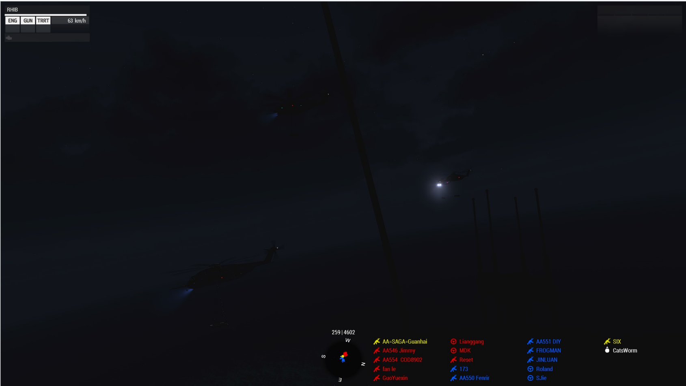   
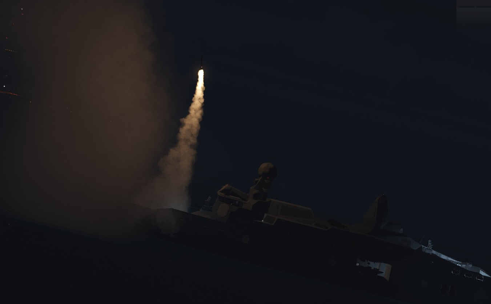   
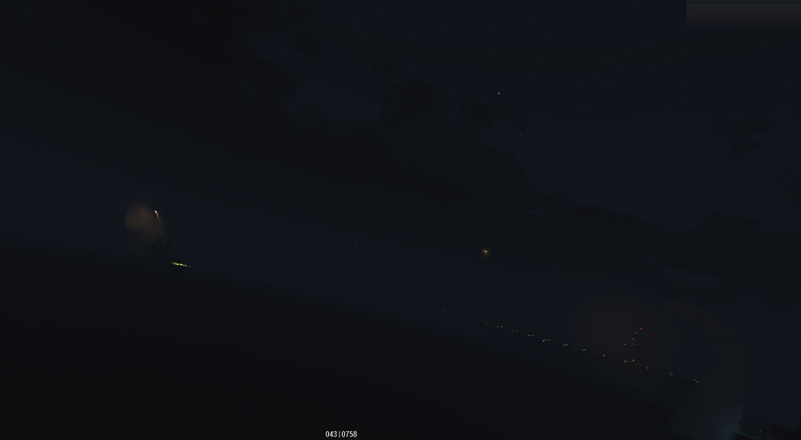  
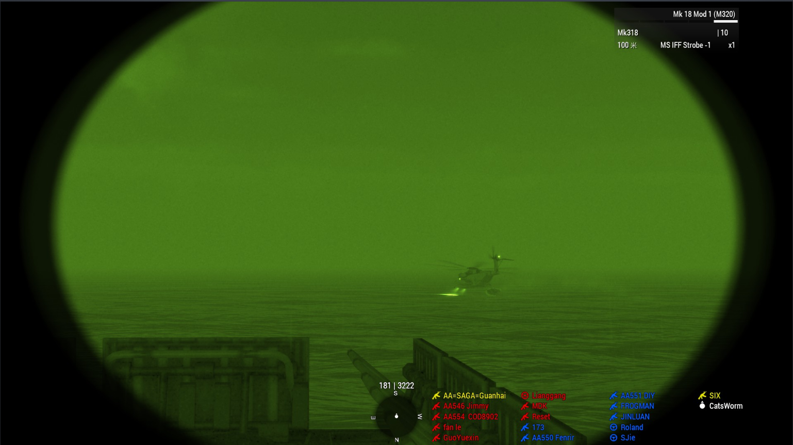   
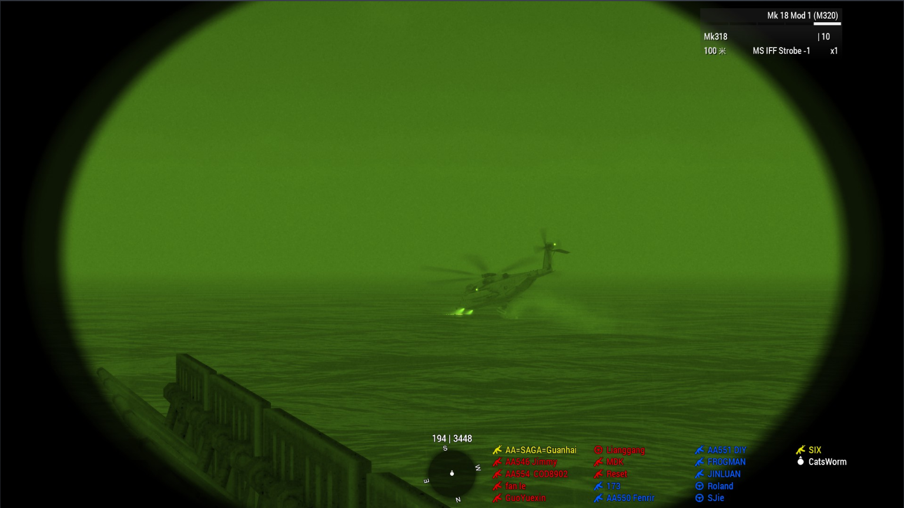   
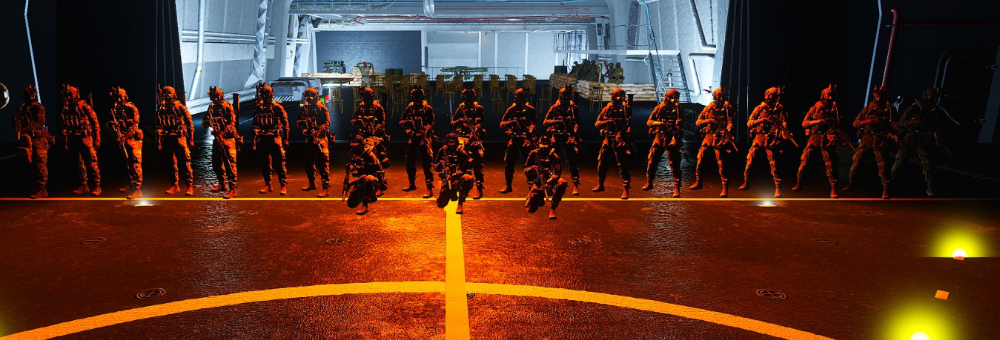   
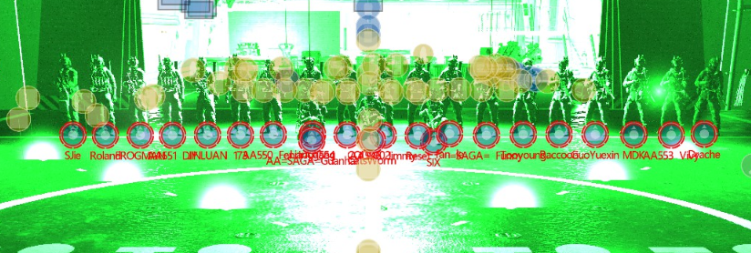   
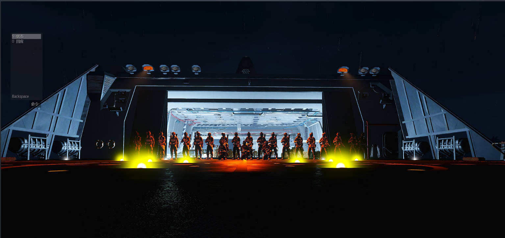   

---
[返回ARMA](https://saga2003.github.io/arma.html)
[返回主页](https://saga2003.github.io/)