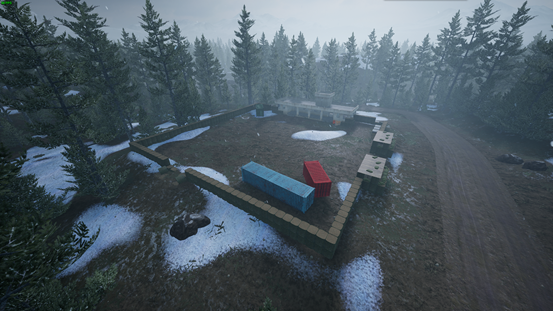
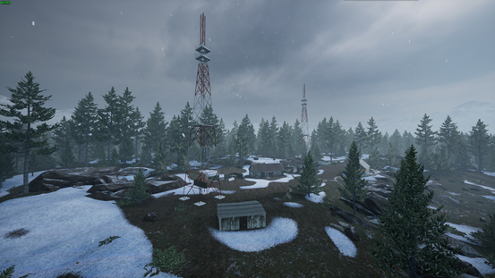

[主页](https://saga2003.github.io/)   -  [Battlefield](https://saga2003.github.io/battlefield.html)   -   [ARMA](https://saga2003.github.io/arma.html)   -   [SQUAD](https://saga2003.github.io/squad.html)   -   [Rainbow6](https://saga2003.github.io/rainbow6.html)   -   [Racing](https://saga2003.github.io/racing.html)   -   [Others](https://saga2003.github.io/others.html)

# SQUAD一命制活动展示

### 活动时间：2021年10月09日

### 活动名：流血的洋甘菊

活动日期|活动名称|视角提供者|链接|备注
---|---|---|---|---
2021-10-09|流血的洋甘菊| 多人视角 |[网址](https://www.bilibili.com/video/BV1sL4y167nz/)|第一视角
2021-10-09|流血的洋甘菊| =SAGA=EmoB |[网址](https://www.bilibili.com/video/BV173411C78n/)|第三视角

## 任务简报

### 任务背景
一个俄罗斯摩托化步兵穿插连进入到被美军占领的Belaya地区后，损失过半，全连仅剩80名人员和少量轻型装甲车辆。  
美军某步兵团指挥部设在Belaya，俄军得到情报，指挥部驻地仅有3个警卫班，在指挥部西边有两座无线电信号塔和一个弹药库已被美军占领并使用，并由1个美军游骑兵班进行守卫。距此地最近的美军前线基地驻扎有大量机械化步兵和装甲部队，但由于美军的主要通讯系统遭到干扰，美军指挥部仅能通过西边的无线电信号塔与该基地联系，两地相距10分钟车程。  
俄军穿插连残余部队临时重组整编。他们的首要任务是摧毁敌方指挥部。  

### 任务目标
#### 俄军：
主要任务：摧毁美军指挥部（摧毁电台），杀死奎林上校。  
可选任务1：占领美军弹药库，获取炸药和迫击炮。  
（可选任务1完成后才能进行可选任务2，同时获得3次82mm迫击炮6发版指挥官技能支援）  
可选任务2：使用炸药摧毁两座信号塔。  
（可选任务2完成后，美军不能呼叫增援和使用指挥官技能）  

#### 美军：
主要任务：保护奎林上校和指挥部。  
可选任务：保护弹药库和信号塔。  

### 示意地图 
 

美军指挥部
 

弹药库

信号塔

### 游戏规则
#### 胜利条件：
俄军：美军指挥官奎林上校死亡+美军指挥部电台被摧毁。
美军：俄军穿插连80人全员阵亡或游戏正式开始2小时后俄军未完成主要任务。  

#### 对战规则：
以SAGA一命制活动规则为基础！  
换图后，美军全员家里复活，OP刷5辆运兵卡，把里面的300弹药卸掉后用作代步。美军有15分钟部署时间进行准备。其中包括必须项：在图示指挥部位置放置一个FOB电台，电台必须放置在图示蓝色圆形范围里的建筑物内，禁止卡BUG电台，此操作使用补给卡完成，顺带携带1500弹药1500建材作为初始物资。  
美军指挥官奎林上校禁止离开指挥部（以图示蓝色圆形为准），且美军指挥官仅有待在指挥部FOB电台3米范围内才能使用指挥官技能和呼叫支援。  
美军可在指挥部FOB范围内自由建设任何固定设施（包括但不限于机枪堡、维修站、防爆墙、陶式导弹），但禁止使用除铁丝网外的任何部署物、载具堵住任何一栋建筑的出入口。  
美军巡逻侦查小队除了不能压家（参考SAGA#1服对Belaya压家的规定），活动范围不限。  
美军3个警卫班及其载具（斯崔克）活动范围仅限指挥部FOB外圈（400米范围内）  
美军游骑兵班使用MOD里带Ranger字样的兵种，活动范围为信号塔和弹药库两地直线连接所经过的3个由公路划分的不规则区块（地图上公路划分出的区块，以公路为界）游骑兵班队长自行决定如何分配9人的部署。  

美军15分钟准备时间结束后，裁判黄字告知正式开始。  
正式开始30分钟后，如果俄军未完成可选任务2，则美军可呼叫支援，支援在收到呼叫10分钟后由OP刷新在美军家里。支援单位为1辆M1A2坦克+组员3人、2辆M2A3布莱德利战车+组员4人、2个9人满编步兵班，共计25人。（这些单位由美军死亡的玩家复活后使用和扮演，美军死亡的玩家中哪些玩家可以复活由指挥官和小队长决定，每名玩家最多可复活1次。由指挥官统计上报，OP监督。如果支援已经到达，但美军还没有这么多人死，则优先使用火力更强的单位：坦克>步战车>步兵）。  
注意：支援单位必须直接前往指挥部，载具以最短路径的公路前往，到达指挥部后活动范围与美军普通步兵班一致。  

美军指挥官在俄军完成可选任务2之前在指挥部电台3米内可使用指挥官支援技能，不额外添设冷却时间，数量如下：  
155mm烟雾弹覆盖 1次  
120mm迫击炮6发版 1次  
81mm迫击炮6发版 3次-俄军完成可选任务1后禁用  
战斧巡航导弹 2次  
A-10投弹攻击3次  
注意：美军使用杀伤性指挥官技能，任意一个爆炸落点在信号塔蓝色区域内，算作摧毁两座信号塔！  

正式开始10分钟后可使用下图所示物资空投（内含1500建材1500弹药） 1次   
 

正式开始后，OP在俄军家里刷3辆运兵卡卸掉弹药后备用用作代步（第一批复活的俄军应该会使用虎式代步，但不作强行要求）。俄军玩家集体在家里复活并自由行动，除了不能压家（参照SAGA#1服对Belaya压家的规定），所有俄军活动范围不限。  
俄军由于失去此地制空权，且穿插连深入敌后作战，因此除了在完成可选任务1后可使用3次82mm迫击炮外，无任何可使用的技能支援。  
俄军总可用人员为80人（包括载具组员、指挥官）。  
例：正式开始时有43名俄军玩家复活，则后续有37个名额的复活机会。  
哪些玩家能复活由指挥官和小队长决定，由指挥官统计上报，OP监督，每名玩家最多可复活2次。  

### 报名表双方人员/载具
#### 俄军：
5人侦查班1个（队长、医疗、弹药兵、特射、特射）  
9人标准步兵班4个，其中一个班由指挥官带领  
其中两个班的支援组分别设1名重筒，1名轻筒，均使用RPG-7  
俄军每班有1名工兵，使用MOD里装备KS-23霰弹枪的“破坏者”。工兵在完成可选任务1之前，不可使用炸药。  
虎式装甲车电遥版1辆  
虎式装甲车手摇版3辆  

#### 美军：
3人巡逻侦查小队1个（队长、医疗、特射）  
9人标准步兵班3个，其中一个班由指挥官带领  
其中一个班的支援组设2名轻筒  
9人游骑兵班1个，使用MOD里带Ranger字样的兵种  
MOD里的Ranger只有小队长、重筒、步枪、班机、火力组长这几个兵种，设置报名表时应注意。  
M-ATV手摇版 1辆（此载具如果由巡逻侦察小队使用，则不限制活动范围）  
M1126斯崔克 1辆（指挥官的班抽出2人来驾驶，不额外设报名位，活动范围与步兵班一致）  

### 关于任务的判定
俄军可选任务1：当俄军任意一名工兵进入弹药库的白色建筑内，则判定俄军取得了炸药和迫击炮，判定俄军可选任务1完成。  
俄军可选任务2：工兵在两座信号塔下都放置炸药（放置位置在塔底任意一个白色底座上）并成功爆炸，则判定俄军可选任务2完成。  

其他问题欢迎咨询作者：金鹰Geagle  

**本次活动由PZY提供服务器赞助。对SQUAD丧尸模组感兴趣玩家欢迎前往叙利亚影业服进行游玩。**

[返回一命制](https://saga2003.github.io/squad.html)
[返回主页](https://saga2003.github.io/)