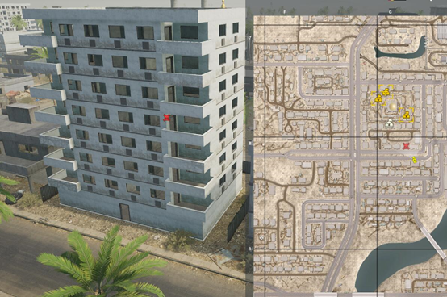

[主页](https://saga2003.github.io/)   -  [Battlefield](https://saga2003.github.io/battlefield.html)   -   [ARMA](https://saga2003.github.io/arma.html)   -   [SQUAD](https://saga2003.github.io/squad.html)   -   [Rainbow6](https://saga2003.github.io/rainbow6.html)   -   [Racing](https://saga2003.github.io/racing.html)   -   [Others](https://saga2003.github.io/others.html)

# SQUAD一命制活动展示

### 活动时间：2021年10月16日

### 活动名：金色的土地黑色的血

活动日期|活动名称|视角提供者|链接|备注
---|---|---|---|---
2021-10-16|金色的土地黑色的血|多人视角|[网址](https://www.bilibili.com/video/BV1pQ4y1z7Pz/)|第一视角

## 任务简报

### 故事背景：
美国以石油为目的进入当地，但是当地进入动荡状态，而美国派遣的石油采集集团的负责人被困城中。  
来自美国的伯尔斯科技公司，通过贿赂当地政府而廉价获得了当地的石油开采权。而来到当地的伯尔斯公司一边通过低成本开采石油，一边进行违法秘密实验，当地的平民在长期的不平等对待和人口失踪之下，由邻国的石油采集集团的支持下发起了暴乱推翻了当地政府，并且把伯尔斯集团在城中视察的代号为“伏特加”的公司主管围困在城中。  
在自身尝试撤离失败之后，伯尔斯科技公司的残余人员对外发布了求援信号，就近巡逻的美军第82空降师一部在重金悬赏下准备救援。而同样收到了求救信号的邻国石油采集集团，决定派遣一支特遣队去抓捕这个代号为“伏特加”的公司主管来获得更多的公司内部信息。  

### 任务目标：
叛军：阻止美军带走目标“伏特加”  
美军：营救在目标点的“伏特加”带离至美军基地   
  

### 装备配置：
#### 美军
1. 美军M1A3布莱德利步战车*1
2. 美军7人机动步兵班*1乘坐布莱德利步战车
3. 美军标准9人步兵班*3每班乘坐2辆伏击车
4. 黑鹰运输机*1
5. 1架高空无人机
6. 因紧急升空未满载A10攻击机一架（机炮支援*3）任务开始后1小时进场，不可攻击人质和周围建筑。
7. 空投补给支援*1
8. 补充兵：美军基地内有留守的3个步兵班，需要队伍内1人撤离到基地后补充，一次补充消耗1队不限人数。

#### 叛军
1. 老式BMP1战车*1（无垂稳）  
2. 民用无武装载具少量（无弹药）  
3. 固定式得仕卡4座（可放置2个电台每个电台300弹药不可放置弹药箱）  
4. 卡车防空炮*1  
5. 一架大疆无人机  
6. 叛军9人民兵小队*3  
7. 叛军6人游击队*1  
8. 叛军工兵班*1（IED不可补充，地雷不可补充）  
9.  补充兵：当地暴民领袖在积极动员本地平民，但是需要时间集结与重组，任务开始1小时后阵亡的暴民可在基地复活1次（复活的成员只可使用步枪兵装备除队长）  

#### 特殊规则：
1.	美军空投补给只可放置防御类（墙，沙袋）不可放置维修站  
2.	叛军开始部署时不可越过地图北侧河道，但不限制在桥口埋雷（不可埋bug雷看不到卡地里的，一经发现永久踢出活动）  
3.	美军VIP为重伤，只有当友军面对面5米内才可活动  
4.	叛军任务期间不得在VIP楼内防守，当美军有人进入人质楼内则此条作废。  
5.	双方都不可击杀人质，误击则算作阵营失败  
6.	美军运输机携带全为弹药，但是不可再基地内从新补给和维修  

**本次活动由PZY提供服务器赞助。对SQUAD丧尸模组感兴趣玩家欢迎前往叙利亚影业服进行游玩。**

[返回一命制](https://saga2003.github.io/squad.html)
[返回主页](https://saga2003.github.io/)