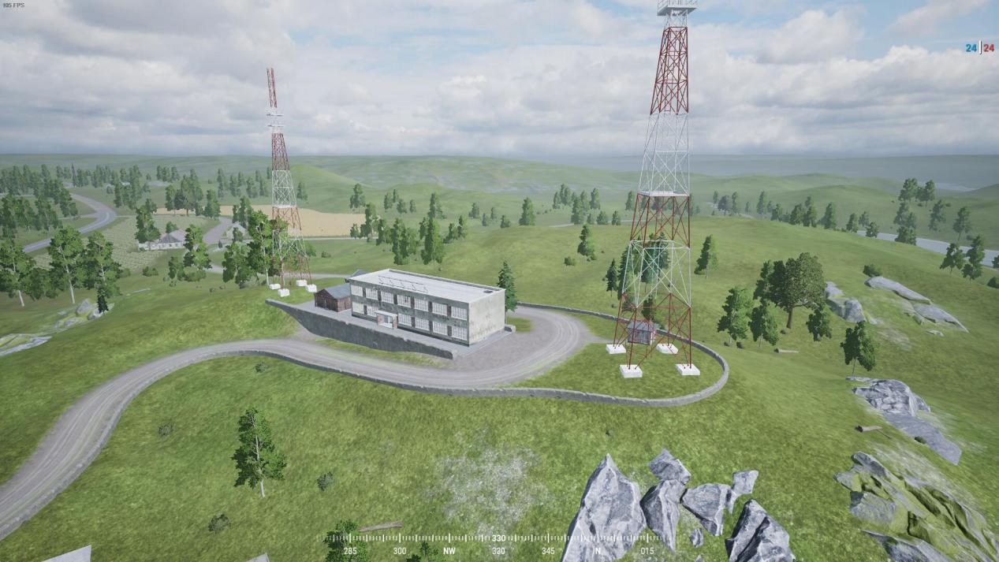
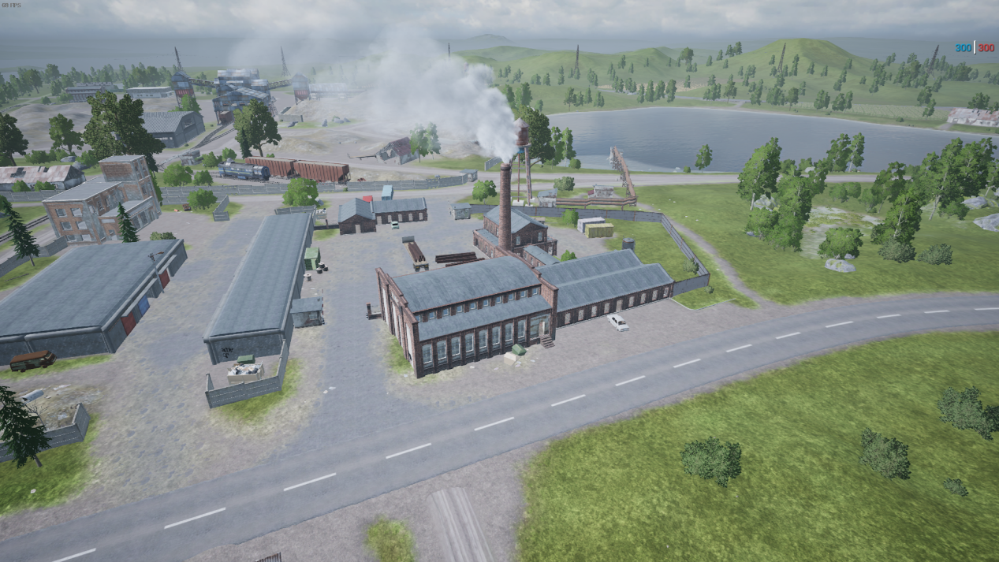
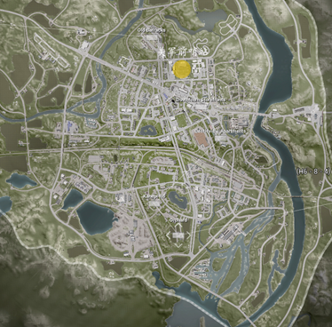
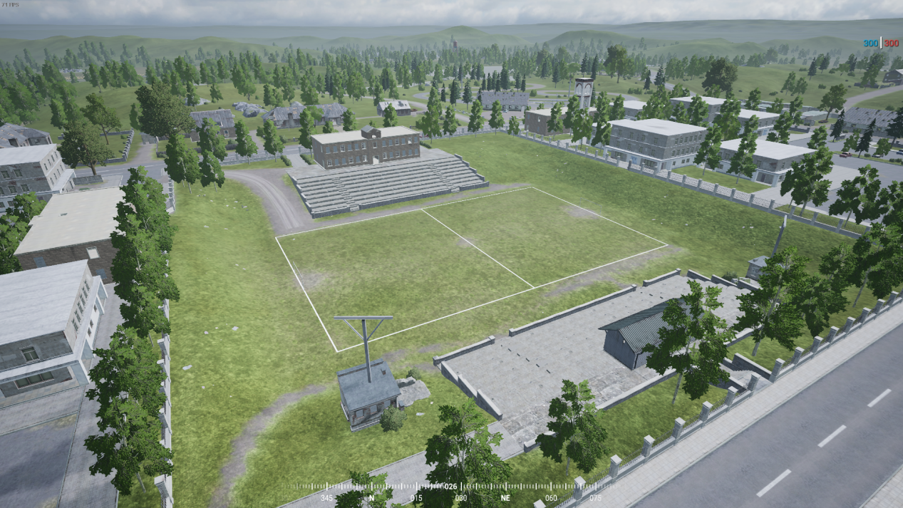

[主页](https://saga2003.github.io/)   -  [Battlefield](https://saga2003.github.io/battlefield.html)   -   [ARMA](https://saga2003.github.io/arma.html)   -   [SQUAD](https://saga2003.github.io/squad.html)   -   [Rainbow6](https://saga2003.github.io/rainbow6.html)   -   [Racing](https://saga2003.github.io/racing.html)   -   [Others](https://saga2003.github.io/others.html)

# SQUAD一命制活动展示

### 活动时间：2021年11月13日

### 活动名：纳尔瓦地区争夺战

活动日期|活动名称|视角提供者|链接|备注
---|---|---|---|---
2021-11-13|纳尔瓦地区争夺战|莱特-official|[网址](https://www.bilibili.com/video/BV1pQ4y1U7ud/)|第一视角
2021-11-13|纳尔瓦地区争夺战|SQ541 Madman|[网址](https://www.bilibili.com/video/BV1og411K7gx/)|第一视角
2021-11-13|纳尔瓦地区争夺战|=SAGA=EmoB|[网址](https://www.bilibili.com/video/BV1Nh411b77B/)|第三视角

## 美军简报
### 任务背景
冷战期间美国通过多次挑拨该地区武装力量扰乱本地政府军导致政府军无法有效遏制该地区武装力量。美军假借帮忙清理本地反政府武装力量为理由驻扎在此地，企图傀儡本地政府企图对俄军境内造成不利。俄国得知情报，碍于证据不足无法发动大规模行动清扫美军，只能秘密作战。   
美军在该地驻扎已久并且在20公里外有一处机械化作战部队驻扎营地。  
如有需要即可在20分钟内抵达该地。  
另外在10公里处有俄军爆破班组正在向本地移动 因为信号干扰无法确定到达时间。  
### 作战任务
#### 美军：
主要任务：保护己方指挥官存活并且消灭俄军士兵  
俄军占领前哨站会获得信号塔位置  
俄军占领信号塔会获得指挥部位置  
次要目标: 保护信号塔不被摧毁并且坚守20分钟支援到达
如果信号塔被占领  
可以选择撤退或者摧毁信号塔  
（但是如果俄军占领完好的信号塔会导致一定量时间后俄军获得载具支援）  
我放可以组织士兵重新抢夺信号塔  
注意如果重新夺回信号塔呼叫支援的时间缩短为5分钟  
电台需要放在信号塔地下一楼  
  
  
 
### 作战地图
  

### 美军前哨站
 
 
### 美军信号站
 

### 美军指挥部
 
 
### 胜利条件：
美军：俄军在该地部署士兵全部阵亡或者在本地坚持  
两小时(其他驻扎部队赶到此地消灭该地区俄军)  
(指挥官可在任意时刻宣布自己部队撤离该战区)  

### 对战规则：
本场游戏以SAGA一命制活动规则为基础！  
地图刷新后美军在家中复活有五分钟准备时间开车前往部署地点布防 指挥官和警卫员开补给卡去指挥部建造设施   
其他个小队分开前往其他地点建造FOB电台(仅能使用补给卡或者乘坐侦察车移动)补给卡为1200弹药和1200建材(信号塔仅允许建造兵站和弹药箱和防御设施不包括杀伤性武器)  
每个区域必须有一辆补给卡前往  
(指挥官小队仅能使用1500弹药.1500建材用来在指挥部区域内建设)。开局五分钟之后美军仅有15分钟部署时间进行准备。  
其中包括必须项：在指挥部区域放置电台建造兵站  
在该地进行布防  
载具可移动范围为指挥部和信号站  
美军指挥官无法离开指挥部区域（以指挥部区域黄色区域为活动范围），  
美军可在指挥部FOB区域内任意建造固定武器和防御设施(但不包括迫击炮)不允许使用建筑挡门  
每个占领点都有一个FOB（电台）如果电台被摧毁无法及时在60秒内补救即算作被占领  

美军15分钟准备时间结束后，裁判告知作战正式开始。  
如果美军发现敌军第一个人开始20分钟后，如果俄军没及时摧毁信号站则美军支援部队抵达  
支援内容如下：  
    一辆M1126斯崔克+驾驶2人  
一辆M1A2坦克+驾驶3人  
两次全体复活增员机会  
支援到达可能会有俄军重型爆破人员抵达现场   
（该支援由在作战期间阵亡的玩家扮演 载具和步兵） 
如果增员抵达美军没伤亡那么多人优先增员载具   
（M1A2坦克>M1126斯崔克>步兵）  
  
增员抵达之后由管理员刷新支援(或者使用家里现成的)  
增员抵达后优先需要到指挥部报道  

### 敌方人员/载具
#### 俄军：
大量敌军班组人员  
几辆轻型载具  
可能会有俄军重型爆破人员  
### 美军：  
指挥官小队  
9人标准步兵班4个，(指挥官活动区域为指挥部附近)  
队伍配置：(小队长 医疗 轻筒 榴弹兵 班用机枪 步枪兵 精确射手)  
M-ATV手摇版 2辆(载具由步兵班分人去使用)  
一辆M1126斯崔克(由指挥官分配人员去开)弹药需要去出生点补给  
斯崔克活动距离只有指挥部和信号塔附近   
两次全体增员   
复活地点为美军指挥部或者信号塔兵站  
碍于国际局势双法无法动用大规模火力支援和空中支援  

如果有好意见可以联系 奇迹和魔法  
裁判拥有所有规则的最终解释权 如有违规裁判拥有决断权  

----------------------------------------------------------------

## 俄军简报
### 任务背景
冷战期间美国通过多次挑拨该地区武装力量扰乱本地政府军导致政府军无法有效遏制该地区武装力量。美军假借帮忙清理本地反政府武装力量为理由驻扎在此地，企图傀儡本地政府企图对俄军境内造成不利。俄国得知情报，碍于证据不足无法发动大规模行动清扫美军，只能秘密作战。  
美军在该地驻扎已久并且在20公里外有一处机械化作战部队驻扎营地  
如有需要即可在20分钟内抵达该地  
另外在20公里处有俄军爆破班组正在向本地移动 因为信号干扰无法确定到达时间  

### 作战任务(俄军)
#### 主要任务：
任务一：摧毁在本地驻扎的美军指挥部军官(代号李)。   
任务二：进攻美军前哨站获得后续目标地点坐标   
由黄字告诉大致位置 列:G10-4-8   

### 战场地图

 
### 美军前哨站

### 胜利条件：
俄军：击杀美军指挥官并且摧毁电台   
(指挥官可在任意时刻宣布自己部队撤离该战区)   

### 对战规则：
作战时长为：2小时   
本场游戏以SAGA一命制活动规则为基础！   

每个占领点都有一个FOB（电台）摧毁电台并且等待60秒电台消失即可算作占领   

美军15分钟准备时间结束后，裁判告知作战正式开始。   
如果美军发现第一个俄军开始20分钟后，如果俄军没及时摧毁或者占领信号塔则美军支援部队抵达   
支援内容如下：  
    几辆中型载具  
一辆重型载具  
小部分美军支援  
（该支援由在作战期间阵亡的玩家扮演 载具和步兵）  
如果增员抵达美军没伤亡那么多人优先增员载具   

增员抵达之后由管理员刷新支援(或者使用家里现成的)  
增员抵达后优先需要到指挥部报道  

### 双方人员/载具
俄军：  
指挥官小队  
9人班组4个  
虎式装甲车电摇版本一辆辆(复活可能需要去接送人员)  
若干辆运兵卡  
俄军小队职业可分配为(队长 医疗X2轻筒X1 榴弹兵X1 班用机枪X1 步枪兵X2工兵X1) 如果美军支援到达俄军获得四个重筒名额由指挥官分配 并且获得一个集体复活机会  
俄军每班仅一名工兵 炸毁信号塔需要两名工兵同时在场  
开始有两次全体增员机会 拿下一个点增加一次复活机会  
重筒选择为：RPG29  

### 美军：
中量步兵   
几个轻型载具  
可能会有的中型载具  
可能会有的支援  
碍于国际局势双法无法动用大规模火力支援和空中支援  

如果有好意见可以联系 奇迹和魔法  
裁判拥有所有规则的最终解释权 如有违规裁判拥有决断权  

**本次活动由PZY提供服务器赞助。对SQUAD丧尸模组感兴趣玩家欢迎前往叙利亚影业服进行游玩。**

[返回一命制](https://saga2003.github.io/squad.html)
[返回主页](https://saga2003.github.io/)