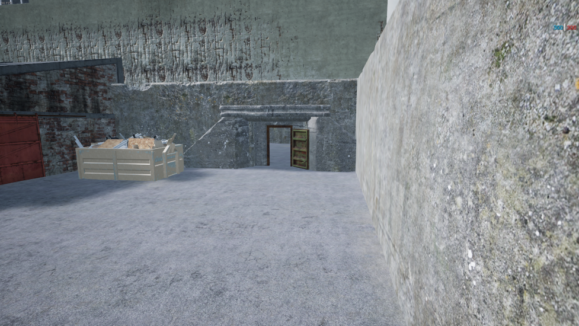
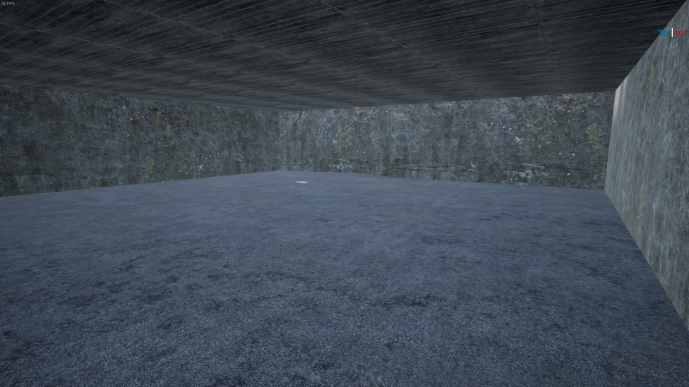
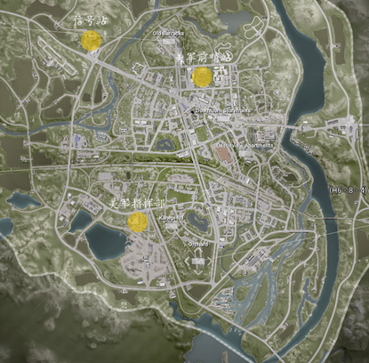

[主页](https://saga2003.github.io/)   -  [Battlefield](https://saga2003.github.io/battlefield.html)   -   [ARMA](https://saga2003.github.io/arma.html)   -   [SQUAD](https://saga2003.github.io/squad.html)   -   [Rainbow6](https://saga2003.github.io/rainbow6.html)   -   [Racing](https://saga2003.github.io/racing.html)   -   [Others](https://saga2003.github.io/others.html)

# SQUAD一命制活动展示

### 活动时间：2021年11月13日

### 活动名：纳尔瓦地区争夺战

活动日期|活动名称|视角提供者|链接|备注
---|---|---|---|---
2021-11-13|纳尔瓦地区争夺战|莱特-official|[网址](https://www.bilibili.com/video/BV1pQ4y1U7ud/)|第一视角
2021-11-13|纳尔瓦地区争夺战|SQ541 Madman|[网址](https://www.bilibili.com/video/BV1og411K7gx/)|第一视角
2021-11-13|纳尔瓦地区争夺战|=SAGA=EmoB|[网址](https://www.bilibili.com/video/BV1Nh411b77B/)|第三视角

## 任务简报

### 黑色小队任务简报

本该在纳尔瓦该地驻守的美军被俄军突如袭来的进攻打的节节败退,导致该地的部分实验设施中的资料和部分实验物品无法第一时间转移和摧毁,并且根据情报得知,俄军已经高层已经派遣生化专家和一个营的兵力在向该地区移动，公司要求你们带走该地区设施内的剩余研究资料和研究样本，并且清扫知情人员。

#### 任务细节: 
1.	该地区现任指挥官无权对你们实行任何指挥  
2.	你们可以动用任何该地区的载具(不包括坦克.布莱德利)  
3.	只能同一时间存在和驾驶一辆载具(在前一个载具存在无法使用或者被摧毁之前无法使用第二个载具)  
4.	你们可以直接前往最终任务地点  
5.	你们的只有一条命(无复活机会)  
6.	有必要可以清理掉该地区俄军俘获的俘虏，他知道一些不该知道的信息.  
7.	该班组可以在任意位置使用蓝色烟雾弹在该地区召唤一辆载具空投（不包括坦克）。必须离最近的载具300米以外  
8.	俄军准备时间开始5分钟之后即可提前行动 

#### 任务目标:
1.	搜寻藏在该地区的几处疑似信标点的秘钥并携带进入设施内解密资料并将其带走，任务可以不告知该地指挥官和其余士兵(主要任务)  
2.	有必要可以清理掉该地区的被俘军官(非必要任务)  
3.	进入设施二楼守住5分钟即可算作解密成功  
4.	撤离区域为美军出生点  
5.	撤离到美军出生点即可使用返回基地的载具支援其他友军  

#### 设施地图:

  
 
#### 地区卫星图:
   

#### 对战规则：
本场游戏以SAGA一命制活动规则为基础！

### 雄鹰班组任务简报

上次的行动你们做得很好,我们的友军成功俘获了美军的一个高级指挥将领,并且发现了该地区的设施，经由克格勃的信息部的截获信息得知 美军派遣了一只小队在向该地区实验室前进并且向夺取该设施内的实验资料,你们的任务就是阻止他们夺取设施内的样本和资料。

#### 任务细节: 
1.	该地区的指挥官的任务优先级降低,你们的任务优先  
2.	你们可以使用该地区的所有载具（不包括坦克，BMP）  
3.	只能同一时间存在和驾驶一辆载具(在前一个载具存在无法使用或者被摧毁之前无法使用第二个载具)  
4.	你们只有一条命(无复活机会)  
5.	有必要可以击杀被救走的人质  
6.	该班组可以在任意位置使用红色烟雾弹在该地区召唤一辆载具（不包括BMP,T72）。仅限只有一次召唤机会  

#### 任务:
1.	击杀美军特殊小队夺取身上的设施秘钥并且解密设施二楼资料室数据然后带走撤离该地区,该任务该地指挥官和其余士兵不清楚（主要任务）  
2.	阻止美军营救人质（非必要任务）  
3.	夺取密钥前往资料室坚守10分钟即可解密数据完成  
4.	撤离区域在俄军出生点  
5.	撤离回出生点即可使用该班组返回的载具支援其他部队  

#### 设施地图:

  
 
#### 地区卫星图:
   

#### 对战规则：
本场游戏以SAGA一命制活动规则为基础！
该班组的配置和守备班分开计算，

 

**本次活动由PZY提供服务器赞助。对SQUAD丧尸模组感兴趣玩家欢迎前往叙利亚影业服进行游玩。**

[返回一命制](https://saga2003.github.io/squad.html)
[返回主页](https://saga2003.github.io/)