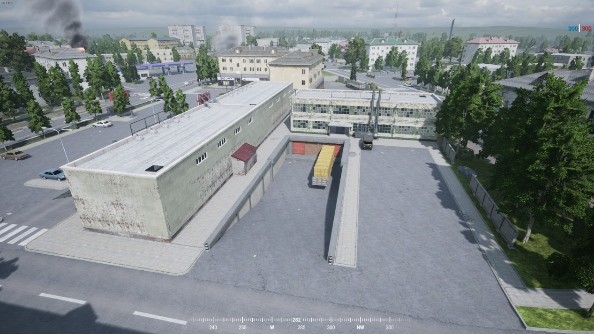
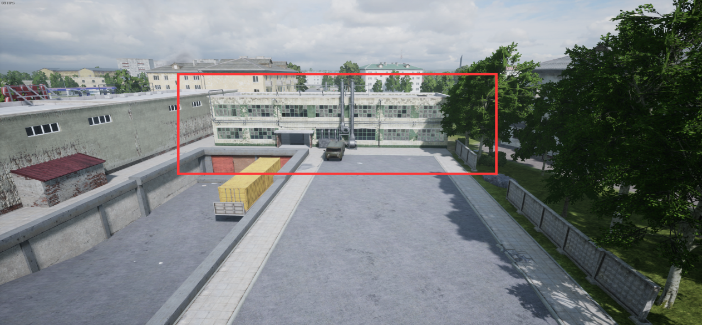
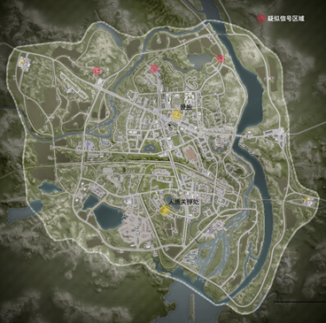
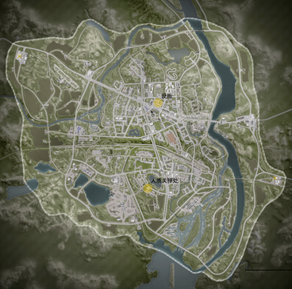
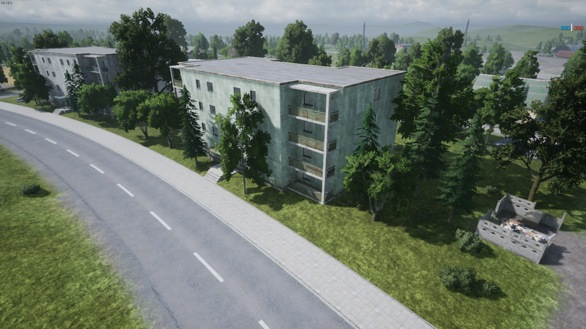
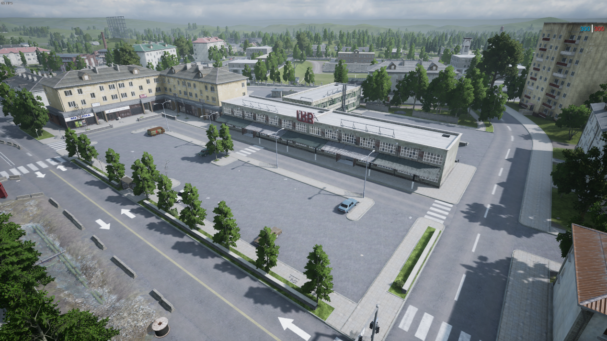
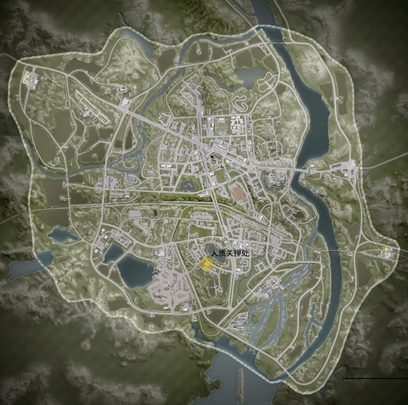

[主页](https://saga2003.github.io/)   -  [Battlefield](https://saga2003.github.io/battlefield.html)   -   [ARMA](https://saga2003.github.io/arma.html)   -   [SQUAD](https://saga2003.github.io/squad.html)   -   [Rainbow6](https://saga2003.github.io/rainbow6.html)   -   [Racing](https://saga2003.github.io/racing.html)   -   [Others](https://saga2003.github.io/others.html)

# SQUAD一命制活动展示

### 活动时间：2021年12月04日

### 活动名：时间与命运/黑色小队

活动日期|活动名称|视角提供者|链接|备注
---|---|---|---|---
2021-12-04|时间与命运/黑色小队|多人|[网址](https://www.bilibili.com/video/BV1M44y1a7ek/)|多人视角
2021-12-04|时间与命运/黑色小队|=SAGA=EmoB|[网址](https://www.bilibili.com/video/BV1zQ4y1i73H/)|第三视角

## 任务简报

### 黑色小队任务简报

本该在纳尔瓦该地驻守的美军被俄军突如袭来的进攻打的节节败退,导致该地的部分实验设施中的资料和部分实验物品无法第一时间转移和摧毁,并且根据情报得知,俄军已经高层已经派遣生化专家和一个营的兵力在向该地区移动，公司要求你们带走该地区设施内的剩余研究资料和研究样本，并且清扫知情人员。

#### 任务细节: 
1.	该地区现任指挥官无权对你们实行任何指挥  
2.	你们可以动用任何该地区的载具(不包括坦克.布莱德利)  
3.	只能同一时间存在和驾驶一辆载具(在前一个载具存在无法使用或者被摧毁之前无法使用第二个载具)  
4.	你们可以直接前往最终任务地点  
5.	你们的只有一条命(无复活机会)  
6.	有必要可以清理掉该地区俄军俘获的俘虏，他知道一些不该知道的信息.  
7.	该班组可以在任意位置使用蓝色烟雾弹在该地区召唤一辆载具空投（不包括坦克）。必须离最近的载具300米以外  
8.	俄军准备时间开始5分钟之后即可提前行动 

#### 任务目标:
1.	搜寻藏在该地区的几处疑似信标点的秘钥并携带进入设施内解密资料并将其带走，任务可以不告知该地指挥官和其余士兵(主要任务)  
2.	有必要可以清理掉该地区的被俘军官(非必要任务)  
3.	进入设施二楼守住5分钟即可算作解密成功  
4.	撤离区域为美军出生点  
5.	撤离到美军出生点即可使用返回基地的载具支援其他友军  

#### 设施地图:

  
 
#### 地区卫星图:
   

#### 对战规则：
本场游戏以SAGA一命制活动规则为基础！

### 雄鹰班组任务简报

上次的行动你们做得很好,我们的友军成功俘获了美军的一个高级指挥将领,并且发现了该地区的设施，经由克格勃的信息部的截获信息得知 美军派遣了一只小队在向该地区实验室前进并且向夺取该设施内的实验资料,你们的任务就是阻止他们夺取设施内的样本和资料。

#### 任务细节: 
1.	该地区的指挥官的任务优先级降低,你们的任务优先  
2.	你们可以使用该地区的所有载具（不包括坦克，BMP）  
3.	只能同一时间存在和驾驶一辆载具(在前一个载具存在无法使用或者被摧毁之前无法使用第二个载具)  
4.	你们只有一条命(无复活机会)  
5.	有必要可以击杀被救走的人质  
6.	该班组可以在任意位置使用红色烟雾弹在该地区召唤一辆载具（不包括BMP,T72）。仅限只有一次召唤机会  

#### 任务:
1.	击杀美军特殊小队夺取身上的设施秘钥并且解密设施二楼资料室数据然后带走撤离该地区,该任务该地指挥官和其余士兵不清楚（主要任务）  
2.	阻止美军营救人质（非必要任务）  
3.	夺取密钥前往资料室坚守10分钟即可解密数据完成  
4.	撤离区域在俄军出生点  
5.	撤离回出生点即可使用该班组返回的载具支援其他部队  

#### 设施地图:

  
 
#### 地区卫星图:
   

#### 对战规则：
本场游戏以SAGA一命制活动规则为基础！
该班组的配置和守备班分开计算，

### 俄军任务简报

#### 任务背景
纳尔瓦战役之后我们成功清理城区大部分驻扎美军，并且我们还抓到了美军的一个中校官衔的一个人，感觉这个家伙知道不少消息 并且我们还在该地搜寻到了一个不明的设施 队伍里没专业人士无法得知该地是用于干什么的  
我们已经通报最高指挥部 指挥部已经派专业人员和大量武装人员前往该地 我们并没有被告知该地设施的作用只告诉我们坚持到支援到达,最高指挥部派遣一直特殊小队在该地执行特殊任务  

#### 额外信息：
最高指挥部已经派遣大量战斗人员和专业人士前往该地的设施 各位坚持两小时即可  
40公里外有不明载具正在前往该区域   
20公里外有友军载具正在向该地前往   

#### 作战任务：
1.	阻止美军营救人质(可以失败)  
2.	守住设施等待最高指挥部派遣人员抵达该区域清扫本地美军(设施内FOB被摧毁并且消失算作失守)  
  作战时间为两个小时 俄军高层已经知道该地设施的重要性已经派遣 专业人士和大量战斗人员前往该区域  
#### 作战地图:
   
 
#### 人质关押处：
   
 
#### 未知设施:
   
   
    
 
#### 对战规则：
本场游戏以SAGA一命制活动规则为基础！  
 地图刷新后有五分钟准备时间 准备时间到达之后补给卡前往人质区域和设施区域部署电台和布防  时间为20分钟  
20分钟到达之后敌军开始进攻  
 (无法建造迫击炮和陶)  
补给卡车*2(5500建材500弹药+600用于建造兵站和弹药箱)只可出现1个弹药箱，人质楼内不可出现工事，只可建造在窗户周边  
设施区域必须拥有兵站(该区域兵站和弹药额外补给600建材用于建造)  
俄军兵站使用第一次重生后无法继续使用  
人质可以在美军即将攻破楼层时采用特殊手段(不可恶意击杀人质)  

#### 人员/装备/载具名单/支援:
   人员: 三个9班组的小队 指挥官小队(指挥官+警卫员)  
   装备: 参考报名表  
   载具: 手摇虎式装甲车 一辆  
BTR-80 一辆  
三辆运兵卡  
缴获的悍马2辆  
两名重型爆破射手  
BTR-82A*1，  
允许使用地雷但是反步兵和反载具地雷只能分别放置2个,炸掉不可补充(铲除即可算作回收)  
悍马/虎式/BTR-80由指挥官分配小队使用  
        支援: 拥有两次指挥官通报全阵营复活(不包括特殊小队)          
        特殊小队装备单独计算不和总部队一同使用  
        特殊小队被攻击可以选择支援或者不理  
退守设施15分钟之后载具到达支援:  
        BTR-82A*2  
        UAV侦察机*1  
        81毫米迫击炮支援*5      

#### 敌方配置:  
      中等量的步兵班若干  
        几辆中型载具  
        几辆轻型载具  
        部分增员  

             祝各位好运  
                          ——最高指挥部  
                          XX月X日。  

### 美军简报

#### 任务背景
纳尔瓦战役之后俄军成功清理城区大部分驻扎美军，但是城外40公里外的第████在12小时之前收到了城中的某处未被俄军清理的小部分美军通过无线电告知城内有高级军官被俄军抓获，该军官知晓████设施的████并且请求14营派小队营救美军在城内被抓的军官和部分士兵摧毁在城中的███设███的据点  

#### 额外信息：
如果本次行动失败 美国会对此次行动和该地区的任何活动表示不知  
40公里的████提前派遣部分载具支援正在赶往该地区    
20公里外有敌方载具正在向该地前往   

#### 作战任务：
1.	营救该地区被困的中校和部分人员(中校知道设施的位置)。将上校带到美军出生点即可算作营救成功    
2.	寻找该地区设施内的12号██并将其摧毁。  
  作战时间为两个小时 俄军高层已经知道该地设施的重要性已经派遣 专业人士和大量战斗人员前往该区域  

#### 作战地图:
   
   
 
 
#### 胜利条件:
1.救援该地的中校。  
2.带走或者摧毁该地设施的12号██。 

#### 对战规则：
本场游戏以SAGA一命制活动规则为基础！  
敌方部署时间到达之后即可搭乘载具前往救援  
设施内有电台 电台摧毁等待60秒消失即可算作摧毁设施  

#### 人员/装备/载具名单/支援:  
   人员: 三个9班组的小队 指挥官小队(指挥官+警卫员)
   斯崔克由载具小队  
   装备: 参考报名表  
   载具: M-ATV .50重机枪(手摇) 两辆  
M1126史崔克 两辆  
若干运兵卡车(仅允许同时在场6辆)  
悍马由指挥官分配小队使用  
成功营救人质15分钟之后己方载具支援到达      
支援: 开始拥有一次指挥官通报全阵营复活，如果成功解救中校并且将中校送往美军出发点即可获得一次全阵营复活,和部分炮击权限和额外UAV侦察机  
救援成功获得额外的 81毫米迫击炮* 2 UAV* 1  

##### 支援载具：
M1126史崔克 两辆  
两名重型爆破射手  
注意：不允许使用AT12如果发现将会严惩  
空中支援：UVA侦察机*1  
          A10攻击机*2  

#### 敌方配置:
      中等量的步兵班若干  
        几辆中型载具  
        几辆轻型载具  
        部分增员  

              祝各位好运  
                          ——███  
                          ██月█日。  

**本次活动由PZY提供服务器赞助。对SQUAD丧尸模组感兴趣玩家欢迎前往叙利亚影业服进行游玩。**

[返回一命制](https://saga2003.github.io/squad.html)
[返回主页](https://saga2003.github.io/)