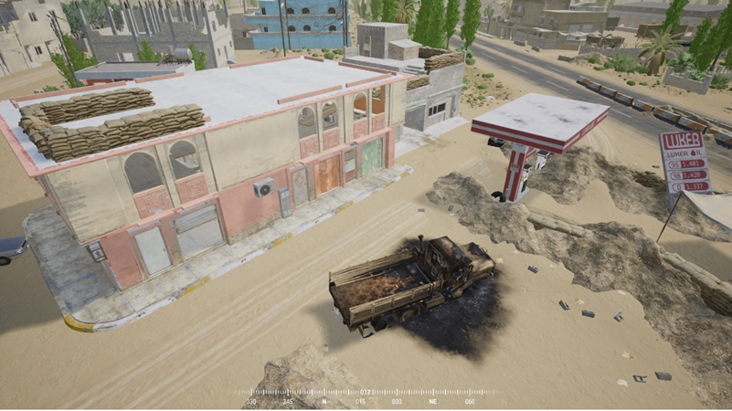
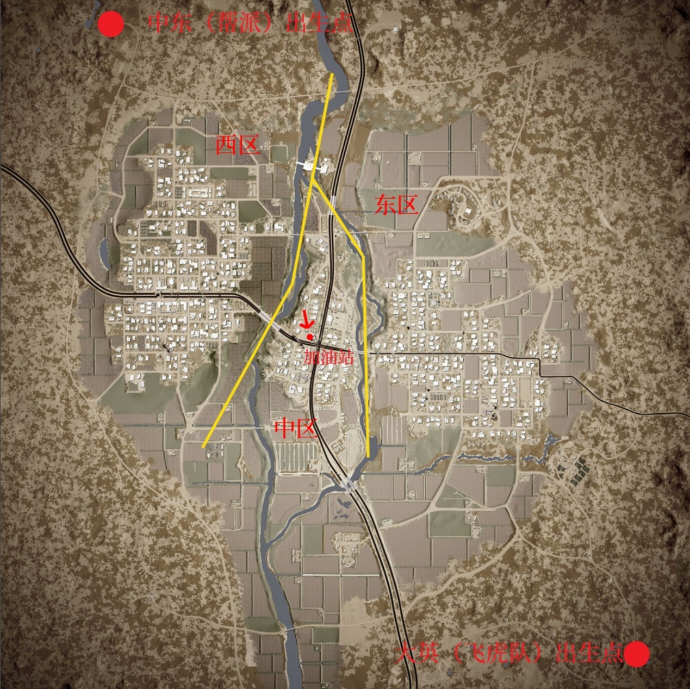
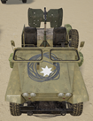
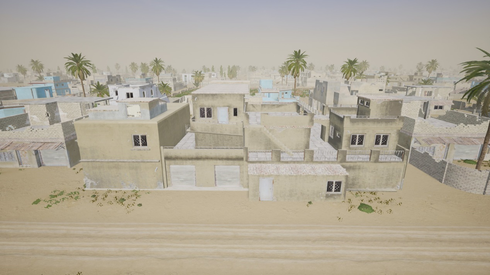
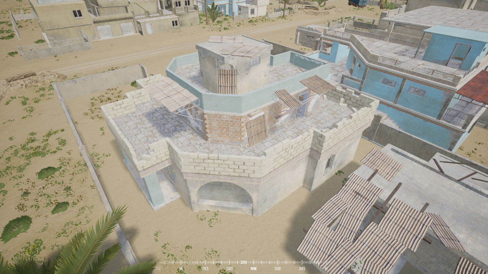
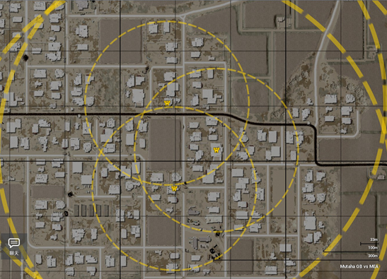
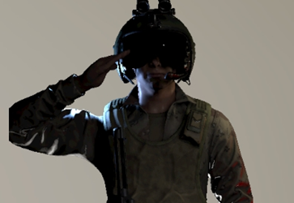
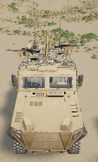
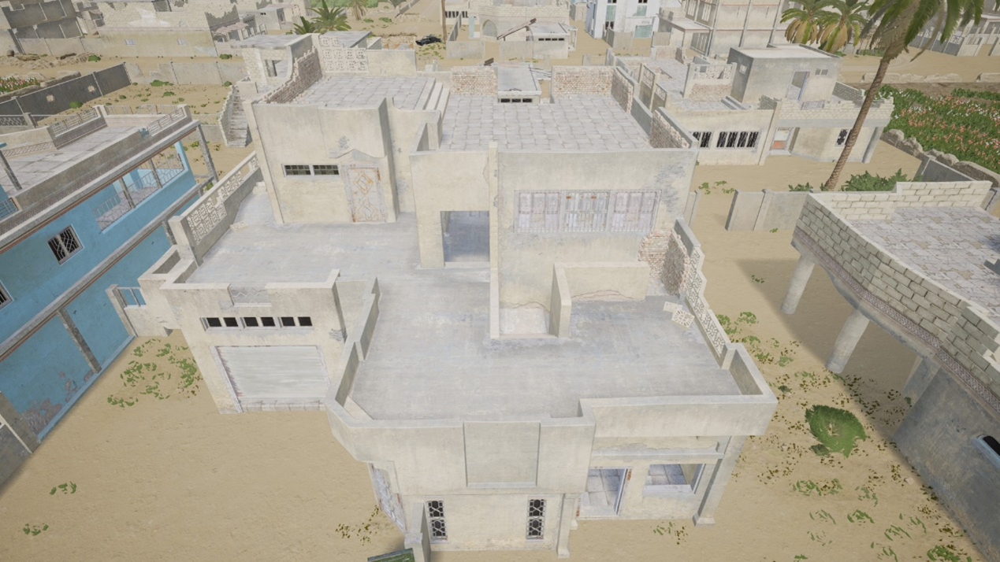
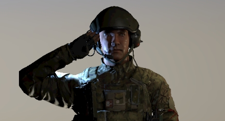

[主页](https://saga2003.github.io/)   -  [Battlefield](https://saga2003.github.io/battlefield.html)   -   [ARMA](https://saga2003.github.io/arma.html)   -   [SQUAD](https://saga2003.github.io/squad.html)   -   [Rainbow6](https://saga2003.github.io/rainbow6.html)   -   [Racing](https://saga2003.github.io/racing.html)   -   [Others](https://saga2003.github.io/others.html)

# SQUAD一命制活动展示

### 活动时间：2021年12月18日

### 活动名：油鸡饭行动/雷霆行动

活动日期|活动名称|视角提供者|链接|备注
---|---|---|---|---
2021-12-18|油鸡饭行动/雷霆行动|Reimurei|[网址](https://www.bilibili.com/video/BV1JQ4y1Y75E)|第一视角
2021-12-18|油鸡饭行动/雷霆行动|=SAGA=EmoB|[网址](https://www.bilibili.com/video/BV1DL4y1J7c7)|第三视角

## 任务简报（公开版）
### 任务代号：
	雷霆行动/油鸡饭行动   

### 任务时间：
    12月18号  

### 标签：
    大英攻中东，巷战，绞肉，轻武装载具  

### 地图：
    OPS_Mutaha_GBvMEA
### 剧情：
大英方（指挥官视角）：长官你好，你目前担任大角咀警察局局长。根据针的线报获知鸿星帮所有工厂与仓库的位置，您计划进行一次大的清场行动，准备一举抓获。  
中东方（指挥官视角）：帮主你好，你目前是鸿星帮的事头。收到差馆的内鬼发过来的料，近日警队内将有一场大的清场行动，因此你打算设局反咬一啖。  

### 任务目标（准备阶段）
A，双方前往己方二阶段防守区域（中东：位于西区；大英：位于东区）进行布置，约20分钟，具体以导演实际公布时间为准。（双方不得逾越）   
B，帮派方前往中区加油站及其相连建筑（下附图）进行防守布置，飞虎队集中在警察局建筑内待命，约10分钟   

### 任务目标（一阶段）
A，飞虎队前往中区，攻占对应建筑物（加油站及其相连建筑），维持占领状态10分钟。  
B，帮派成员在中区中阻挡敌方数个波次进攻。  

### 任务目标（二阶段）
若飞虎队攻占成功  
A，在西区内寻找敌方窝点（电台、兵站和弹药箱，任务开始前至少一日指挥官可在区域内自定义出现位置）并摧毁。  
B，撤退至下个区域，限时内防止敌方捣毁窝点。（弹药箱可供补给，兵站可做撤退时复活点但防御时无作用，电台所在建筑可布置少量指定建筑物）  

若飞虎队攻占失败  
双方按攻占成功的相反目标进行任务  
**注：游戏机制中，电台被摧毁会导致其他重点建筑物被摧毁。且建筑物需布置在电台范围以内。**   
 
### 特殊规则：
0. 此份简报为公开简报。额外简报将分发至各自阵营群中，为公开简报的补充。额外简报内容包含未公开士兵补充次数以及其他详细要求等，详见各阵营群群公告亦或是群文件。  
1. 一阶段结束前，双方活动范围只有各自防守区域以及中区，不能逾越至对方防守区域。  
2. 一阶段结束后，胜利方需在中区进行修整，设立前线补给阵地（电台、FOB与），失败方需要撤离至后方进行防御部署，过程时长为15分钟。双方不得以任何方式越界并获得一次额外补给人员机会  
3. 二阶段帮派成员地点功能一览  
	电台：防守区域的核心，同时也是其他建筑物布置可布置范围的中心点，一旦设立不允许转移。当电台被摧毁时宣告游戏结束；电台建筑内及与其建筑直接接触的街道区段可布置非攻击性防御建筑物，但要求在通往电台单一路径中的任一位置需留至少两个身位的空隙，可翻越的障碍物亦可算作空隙。  
	兵站：增派人员的出生点，不允许设立任何额外建筑物，且一旦设立不允许转移。  
	弹药箱：弹药补给点，可补充弹药，建筑内允许布置机枪，一旦设立不允许转移。  
4. 二阶段飞虎队地点功能一览  
	电台：防守区域的核心，同时也是其他建筑物布置可布置范围的中心点，为数个指定建筑（分局）中的一个，开局前选定后不允许转移。当电台被摧毁时宣告游戏结束；电台建筑内及与其建筑直接接触的街道区段可布置非攻击性防御建筑物，但要求在通往电台单一路径中的任一位置需留至少两个身位的空隙，可翻越的障碍物亦可算作空隙。  
	兵站&弹药箱：增派人员的出生点，可补充弹药，地点为其他指定建筑（未被指挥官选中）。建筑内允许布置机枪，地点为电台点以外的指定建筑。  
5. 筒子兵弹药补充受限制，除非重生否则不允许补筒子的弹药，其他装备则允许。  

### 任务结算
时间结束后统计防守方被摧毁数量和成功防守数量。一阶段目标仅影响任务方向不影响结算结果。  

### 简报更新记录
	V1：初始简报  
	V2：修复了大英弹药点不允许补充弹药的错误，同步了双方兵站的特殊性。  

### 简报图片

   
Figure 1 一阶段冲突建筑
 
   
Figure 2 任务地图

## 任务简报（中东版）

### 行动代号：
    油鸡饭行动

### 附加规则：
1.	职位限制要求  
    a）	轻筒除非死亡后重生否则不允许补充轻筒弹药。  
    b）	非特殊原因（如首次出生或导演及裁判要求等）禁止出生在初始出生点  
    c）	指挥官需卡飞行员模型  
2.	任务初始阶段  
    a）	出生载具：
        i.	Simir MG3 两辆  

   

        ii.	补给卡，三辆（弹药/补给比例不限制，出门后不允许返回基地进行补给）  
        iii.	运兵卡，五辆（后续运兵卡不允许再补充，出门后不允许返回基地进行补给）  
3.	任务准备阶段
    a）	任务目标：前往西区进行防御部署  
    b）	限制要求：  
        i.	特殊建筑（电台，出生点与弹药箱）不允许建在同一建筑中，且两个特殊建筑间需间隔至少一条马路或者一栋建筑。  
        ii.	弹药箱可布置上至三个点位，其余特殊建筑只允许一个。  
        iii.	同一个弹药箱点内最多可放置两挺固定式机枪。  
        iv.	建筑只能放置在选中地点的围栏范围内。  
        v.	特殊建筑位置需至少提前一个小时提交给导演EmoB，任务开始后不允许新增与变更特殊建筑点位。  
4.	任务第一阶段  
    a）	任务目标：前往东区加油站进行防御，抵挡数波敌方攻势  
    b）	阶段内可用补给（不能继承至下一阶段）  
        i.	全阵营集体复活一次（出生点强制为西区出生点）  
    c）	限制要求：  
        i.	准备阶段未使用的建材可使用至中区加油站建筑内，但仅允许建设沙袋和铁丝网。  
        ii.	活动范围仅限中区和西区，不允许跨越东区黄线。  
        iii.	*附近无威胁后方可维修建筑（一命制通用规则）  
5.	任务修整阶段  
    a）	任务目标：全员复活进行修整，复活不纳入计数。  
    b）	限制要求  
        i.	若防守成功，则复活地点为中区加油站内（会建设电台和兵站）。届时会有或允许对应建设费用的增援登场。  
        ii.	若防守失败，则复活地点为西区出生点内。  
6.	任务第二阶段（进攻）  
    a）	触发条件：第一阶段防御成功  
    b）	阶段内可用补给  
        i.	全阵营集体复活一次（出生点强制为中区出生点，不允许复活至西区出生点）  
    c）	限制要求  
        i.	活动地点仅为中区与东区  
7.	任务第二阶段（防御）  
    a）	触发条件：第一阶段防御失败  
    b）	阶段内可用补给  
        i.	全阵营集体复活两次（出生点强制为西区出生点）  
    c）	限制要求  
        i.	活动地点仅为西区  
        ii.	*附近无威胁后方可维修建筑（一命制通用规则）  

### 附录（警察局地址，包含总局与分局） 

   
   
   
   

### 附录二（敌方指挥官样貌） 
   
 
### 简报更新日志  
	V1：初始简报  
	V2：添加防御建筑地点限制，以及增加一阶段防御可建筑种类, 更新警察局点位，新增指挥官卡模型要求  

## 任务简报（大英版）
### 行动代号：
    雷霆行动   

### 附加规则：
1.	职位限制要求  
    a）	轻筒除非死亡后重生否则不允许补充轻筒弹药。  
    b）	非特殊原因（如首次出生或导演及裁判要求等）禁止出生在初始出生点  
    c）	指挥官需卡飞行员模型  
2.	任务初始阶段  
    a）	出生载具：  
        i.	LPPV，一辆    

   

        ii.	补给卡，三辆（弹药/补给比例不限制，出门后不允许返回基地进行补给）  
        iii.	运兵卡，五辆（后续运兵卡不允许再补充，出门后不允许返回基地进行补给）  
3.	任务准备阶段  
    a）	任务目标：前往东区进行防御部署  
    b）	限制要求：  
        i.	每个兵站&弹药箱点位只允许建立最多一个兵站和最多一个弹药箱。  
        ii.	同一个弹药箱点内最多可放置两挺固定式机枪。  
        iii.	建筑只能放置在选中地点的围栏范围内。  
        iv.	总局（电台）的选定需至少提前一个小时提交给导演EmoB，任务开始后不允许新增与变更特殊建筑点位。  
4.	任务第一阶段  
    a）	任务目标：前往东区加油站进行防御，抵挡数波敌方攻势  
    b）	阶段内可用补给（不能继承至下一阶段）  
        i.	全阵营集体复活一次（出生点强制为东区出生点）  
    c）	限制要求：  
        i.	第一阶段开始前全员需先集中在总局位置中，待导演宣布一阶段开始方可出发。  
        ii.	活动范围仅限中区和东区，不允许跨越西区黄线。  
5.	任务修整阶段  
    a）	任务目标：全员复活进行修整，复活不纳入计数。  
    b）	限制要求  
        i.	若进攻成功，则复活地点为中区加油站内（会建设电台和兵站）。届时会有或允许对应建设费用的增援登场。  
        ii.	若进攻失败，则复活地点为东区出生点内。  
6.	任务第二阶段（进攻）  
    a）	触发条件：第一阶段进攻成功  
    b）	阶段内可用补给  
        i.	全阵营集体复活一次（出生点强制为中区出生点，不允许复活至东区出生点）  
    c）	限制要求  
        i.	活动地点仅为中区与西区  
7.	任务第二阶段（防御）  
    a）	触发条件：第一阶段进攻失败  
    b）	阶段内可用补给  
        i.	全阵营集体复活两次（出生点强制为西区出生点）  
    c）	限制要求  
        i.	活动地点仅为东区  
        ii.	*附近无威胁后方可维修建筑（一命制通用规则）  

### 附录一（警察局选点）
   
    
    
   
   

### 附录二（敌方指挥官样貌）
    

### 简报更新日志
	V1：初始简报
	V2，更新警察局可选点位，新增指挥官卡模型要求

**本次活动由PZY提供服务器赞助。对SQUAD丧尸模组感兴趣玩家欢迎前往叙利亚影业服进行游玩。**

[返回一命制](https://saga2003.github.io/squad.html)
[返回主页](https://saga2003.github.io/)