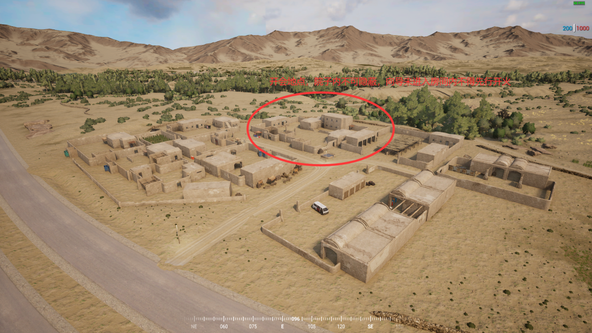

[主页](https://saga2003.github.io/)   -  [Battlefield](https://saga2003.github.io/battlefield.html)   -   [ARMA](https://saga2003.github.io/arma.html)   -   [SQUAD](https://saga2003.github.io/squad.html)   -   [Rainbow6](https://saga2003.github.io/rainbow6.html)   -   [Racing](https://saga2003.github.io/racing.html)   -   [Others](https://saga2003.github.io/others.html)

# SQUAD一命制活动展示

### 活动时间：2022年03月19日

### 活动名：死亡公路

活动日期|活动名称|视角提供者|链接|备注
---|---|---|---|---
2022-03-19|死亡公路|Reimurei|[网址](https://www.bilibili.com/video/BV1mT4y1v7C9)|第一视角 第二阶段
2022-03-19|死亡公路|莱特-offical|[网址](https://www.bilibili.com/video/BV1aL4y1M7Zv)|第一视角 第二阶段
2022-03-19|死亡公路|莱特-offical|[网址](https://www.bilibili.com/video/BV1bL411w7Yv)|第一视角 第一阶段
2022-03-19|死亡公路|胡喵喵|[网址](https://www.bilibili.com/video/BV1J44y1N7SQ)|第一视角
2022-03-19|死亡公路|=SAGA=EmoB|[网址](https://www.bilibili.com/video/BV1XT4y1v7gV)|第三视角 第二阶段
2022-03-19|死亡公路|=SAGA=EmoB|[网址](https://www.bilibili.com/video/BV1or4y1i77E)|第三视角 第一阶段

## 叛军任务简报

### 背景故事：
我们是为真主与自由奋斗的勇士，经历过旧日日不落帝国和俄国的压迫后，我们奋起反抗，想要凭借自身将西方佬和他们扶持的腐朽的傀儡政府驱逐出去，建立真正的国家。他们在本杰瓦尔建立了一个大型军事基地，并以此为中心向我们源源不断地袭击，好消息是他们没有了那些叛徒向导与不是真正真主忠实信徒的本地人，他们将在我们的地区寸步难行，必须神经紧绷到衰弱来防止我们可能的突然的袭击。正如前几天一样，我们袭击了一直正在行驶的美军部队，俘虏了他们并将他们关在我们秘密设立的前哨基地中。但是我们当中少了一些人，这引起了我们的主意，我们怀疑我们的前哨被暴露了，我们必须击退可能来犯的入侵者，保护这些美军不被救出去来增加我们的谈判筹码，保护我们的前哨基地来有充足的时间运输这些珍贵的弹药。真主的子民们，我们体现价值的时候到了！  

### 任务目标：
我们在几小时前摧毁了美军的巡逻队，刚才从英军营地口的兄弟们口中得知，英军派遣了一支救援队伍驶往事发地，而且他们从当地找了一个向导来给他们领路，哪怕伟大的真主麾下也有不一心的战士，但是他也是我们的兄弟，他只是误入歧途我们要引导他回归真主（阶段一不可主动射杀，撤离时解除限制）,并派遣一个队伍（5队,H3-3）隐藏在此地等待他们进入房子开会时扰袭敌方部队，给与后方我军足够的时间转移弹药  

 
开局5队1队与指挥官在前线重生点复活，5队驾驶皮卡车前往村庄进行埋伏（H3-3）1队与指挥官进入山体隧道(H7-9)修建营地（兵站位置，洞内自选，弹药箱必须紧贴电台）      

  
  
  
  
  
  
  

### 阶段一：
在山体内隐蔽等待英军进入事发地，为防止英军挨打后抛下美军伤员逃窜，敌方未放置伤员救助站前不得发起进攻（黄字公告）但是如果敌方试图摸进隧道内则可以开火然后解除限制，全歼敌军（包括fob）  
注*阶段一主干道上全程只可放置1枚地雷与1枚IED(不可越过5号X轴)  

#### 兵力配置
7人步兵班*7个（指挥官到时选择复活班组）  
补给皮卡2辆（可回家拉1次补给，弹药建材不限制）  
迫击炮卡车2辆（无补给）  
得仕卡皮卡1辆  
运兵皮卡4辆  
摩托车5辆  
全部刷在隧道口附近  

**伏击地点为（G7-9）**  
  
  

### 阶段二：
阶段一结束后保留隧道基地以及弹药，阵亡人员全部复活未使用的复活继承到二阶段。  
主线：保护城镇内的联络设置（fob），指挥官在黄色内圈内自行选择位置  

  

支线：保护单独的弹药库（fob），弹药库被毁全阵营不可补充弹药包括后续补充兵，且除轻筒，医疗，波波沙其余兵种全部换成步枪兵（未交战情况下，op会监督）  

  

#### 兵力配置
7人步兵班*10（指挥官到时候选择复活班组）  
SPG筒车*2  
注*阶段二全程只可放置2枚地雷与3枚IED  

## 英军任务简报
### 故事背景：
英军与美军在最靠近叛军腹地的突出部建立了大型军事基地，指挥部将执行今后的任务的部队全部投放在了这座基地中，我们雇佣了大量当地向导来使我们能够使我们在那些极端分子的腹地能够自由通行，但这仍然不能避免我们雇佣到一些别有用心的人，也不能避免我们的车队仍然被偷袭。来自美洲的大头兵们在执行任务途中已经被攻击了，他们被叛军俘虏来作为要挟我们的筹码。我们的当地人告诉我他们可能被抓在这附近的一个秘密前哨基地。老实说我们并不是很想去救这帮自大愚蠢的美军，但是既然将军下命令了，那只能乖乖去救人，顺便捣毁叛军那该死的前哨基地，并且尽量保障那些来之不易的当地导游们。女王保佑，上帝保佑，这会变成一次特别的沙漠旅程。  

### 任务目标：
几小时前附近美军营地的巡逻部队被当地塔利班伏击失去联系，根据当地向导发来的照片与卫星照片（G7-9）得到的消息我们找确定巡逻队还有幸存者但是身负重伤需要就地医治。出发前先到营地外村庄（H3-3）与我方向导回合，他会告诉你此区域敌军情报，但是此城镇内一直有敌军活动注意安全   

  
  

### 任务一：
前往被伏击点，且在道路西侧木房位置建立临时医疗站（FOB）救治伤员（FOB屋内必须有1名医疗），待伤员病情稳定可以转移时（防守25分钟）撤回至英军营地，保护向导。  

#### 作战部队：
LPPV手摇机枪车*3  
FV432手摇*1  
FV432电摇*1  
指挥官警卫班*1  
6人小队*2 乘坐LPPV手摇机枪车  
8人标准步兵班*2乘坐FV432  
A10再次区域协助我方作战  
**注：阶段一无补充兵，无补充载具，如交战过程载具被毁撤离时营地内无车辆增援。 医疗兵需与FOB保持同层，如医疗阵亡或者倒地则停止计时，此时不会有黄字提醒**  

后续任务需从向导口中得知，清剿部队正在路上完成阶段一后残存部队可加入到阶段二中。  

#### 清剿部队：
LPPV手摇机枪车*3  
FV510重甲*2  
运兵卡*4  
A10再次区域协助我方作战  
指挥官警卫班*1（此阶段无补充）  
6人小队*4（每队一次补充）  
8人标准步兵班*4（每队一次补充）  
**注：阶段二载具数量固定，无补充，不限制出发阵容由指挥官自行决定，载具可撤退只基地内但是不可进行维修和补弹，可补给车内弹药**  

**本次活动由PZY提供服务器赞助。对SQUAD丧尸模组感兴趣玩家欢迎前往叙利亚影业服进行游玩。**

[返回一命制](https://saga2003.github.io/squad.html)
[返回主页](https://saga2003.github.io/)