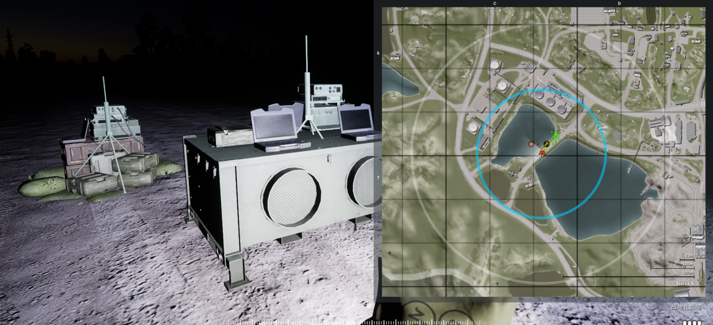
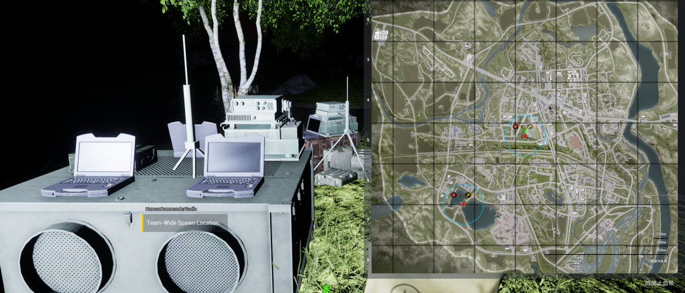
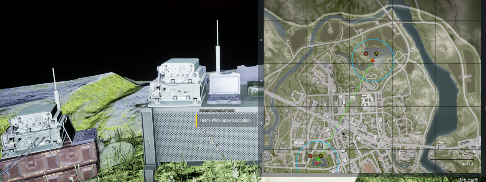
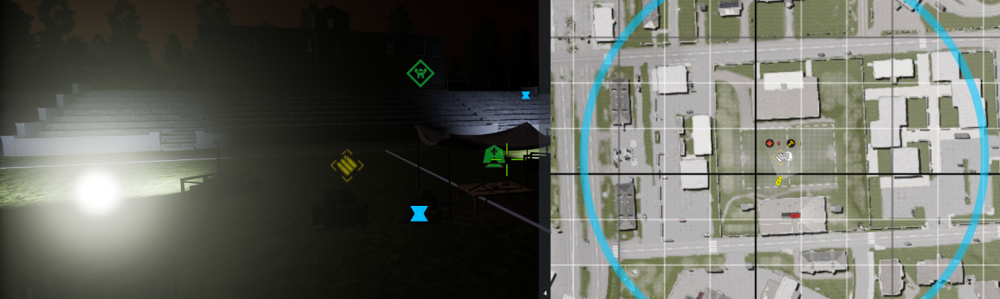
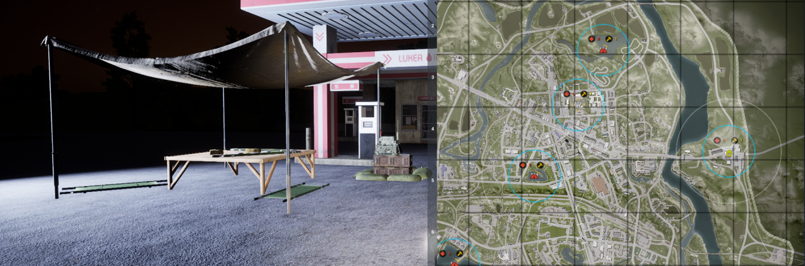
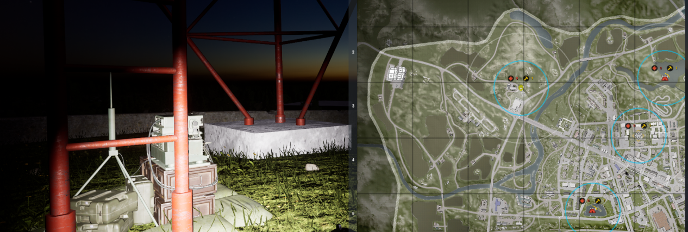

[主页](https://saga2003.github.io/)   -  [Battlefield](https://saga2003.github.io/battlefield.html)   -   [ARMA](https://saga2003.github.io/arma.html)   -   [SQUAD](https://saga2003.github.io/squad.html)   -   [Rainbow6](https://saga2003.github.io/rainbow6.html)   -   [Racing](https://saga2003.github.io/racing.html)   -   [Others](https://saga2003.github.io/others.html)

# SQUAD一命制活动展示

### 活动时间：2022年03月26日（未开始）

### 活动名：虎口脱险

活动日期|活动名称|视角提供者|链接|备注
---|---|---|---|---

## 简报内容
### 故事背景：

因阿曼马特拉湾病毒泄露事件，导致病毒全球范围传播爆发，还有天启教从中作梗，扩大传播以此为自己站到台面上的资本。在东欧的爱沙尼亚突然性爆发了大规模病毒危机，大量平民被感染，形式可危，但是本国常备部队不足以支持阻挡此次事件，世界联盟决定从各地调遣部队增援，而身为原欧盟的一员英国，派遣了离事发地最近的快速反应部队，其与泛亚联盟的装甲部队汇合后，先一步抵达协助爱沙尼亚搜救其本国平民，并且建立隔离带以阻止病毒进一步扩散。

### 人员装备：
警卫班/督战队 x 1

8人标准机械化步兵班 x 4 乘坐反地雷伏击车

8人标准摩托化步兵班 x 2 乘坐运兵卡

M240反地雷伏击车 x 4

.50反地雷伏击车 x 4

主战坦克 x 2

补给卡车 x 2

运兵卡车 x 2

注: 此次任务无补充，无血清，阵亡崴脚意外死亡均自动跳到僵尸，请勿再问怎么办！此次发现问的一律都是没看简报的！

### 任务目标：
#### 阶段性任务1

调查纳尔瓦三处水源，在指定地点放置水源采集器（FOB和1建材设备）每处采集点时间为15分钟，可同时采集多处但是放置fob后补给卡不可离开fob圈

注: 此次任务无自由建设指令，任何设备全在补给卡上.建造于拆除需要补给卡在旁边   

#### 阶段性任务2

在操场内设立平民疏散点(fob)此疏散点需要中间一个医疗站4周4座灯其余不限制,建立完成后防守30分钟撤离时需要全部铲除(灯与医疗站,不可直接铲除电台) 

因载具无法驶入需呼叫空投后可放置fob

#### 阶段性任务3

在城区最东侧桥头城镇建立常驻前哨(fob)此前哨需要一个医疗站并防守30分钟 

#### 功能性任务(常驻)

占领地图西北侧信号站,给与总部信号可获得物资空投支援(占领时每完成一个任务地点可获得2次空投物资支援),未占领信号塔时完成任务不可获得支援 

#### 突发性任务(即时)

因英军长途跋涉到达此地载具油量不是很健康,任务途中可在当地加油站进行补给(地图任意加油站模型).

加油规则:载具停到加油站附近道路上,放置电台后补给卡卸载建材每辆载具旁放置一个维修站(可补弹可维修)由各载具队长记录时间每次停放时长5分钟.

**本次活动由PZY提供服务器赞助。对SQUAD丧尸模组感兴趣玩家欢迎前往叙利亚影业服进行游玩。**

[返回一命制](https://saga2003.github.io/squad.html)
[返回主页](https://saga2003.github.io/)