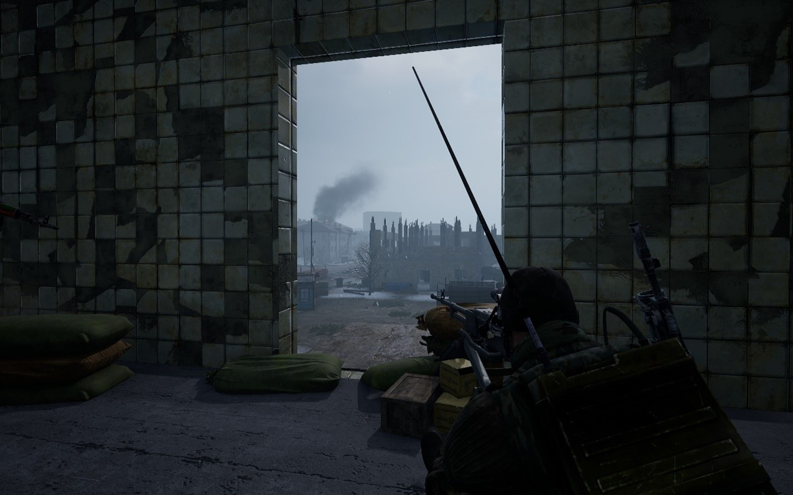
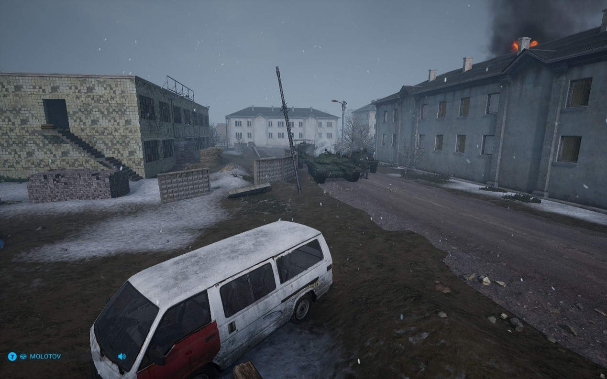
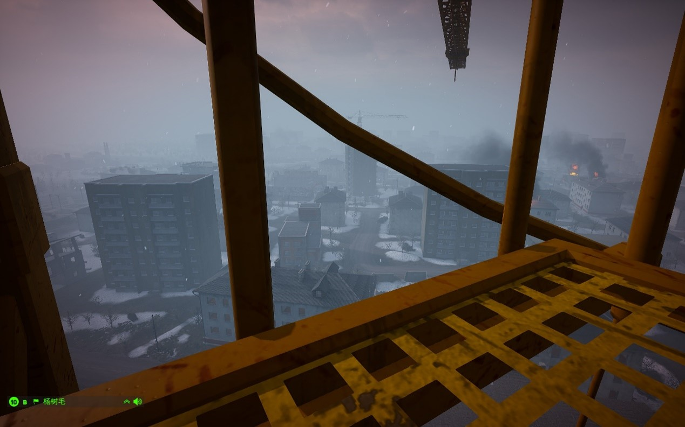
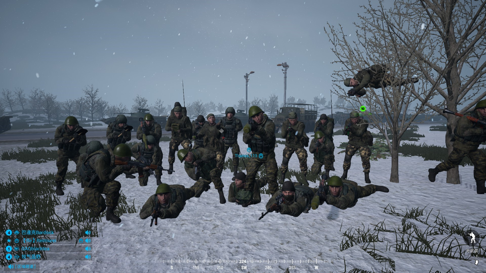
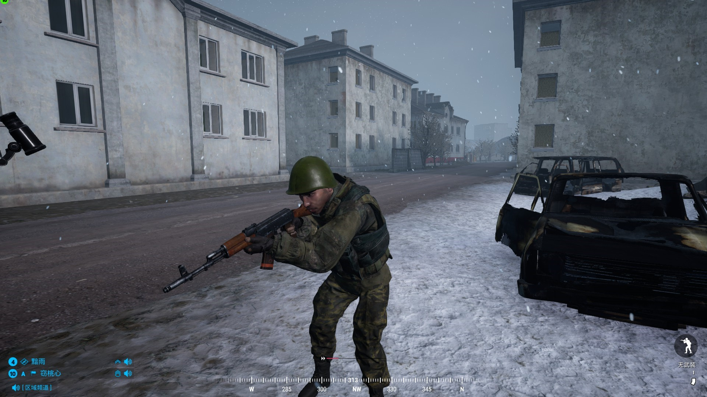
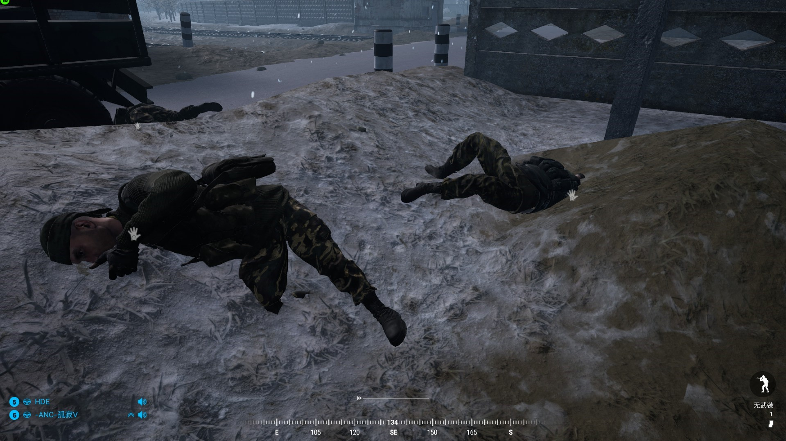

[主页](https://saga2003.github.io/)   -  [Battlefield](https://saga2003.github.io/battlefield.html)   -   [ARMA](https://saga2003.github.io/arma.html)   -   [SQUAD](https://saga2003.github.io/squad.html)   -   [Rainbow6](https://saga2003.github.io/rainbow6.html)   -   [Racing](https://saga2003.github.io/racing.html)   -   [Others](https://saga2003.github.io/others.html)

# SQUAD一命制活动展示

### 活动时间：2022年04月02日

### 活动名：恐懼之城 行动阶段一

### 简报作者：【戰術JK】KOMAROV416

活动日期|活动名称|视角提供者|链接|备注
---|---|---|---|---
2022-04-02|恐懼之城 行动阶段一|KOMAROV416|[网址](https://www.bilibili.com/video/BV1mr4y1W7Y7/)|活动预告1
2022-04-02|恐懼之城 行动阶段一|舜天阈路|[网址](https://www.bilibili.com/video/BV165411S7x6/)|活动预告2
2022-04-02|恐懼之城 行动阶段一|=SAGA=EmoB|[网址](https://www.bilibili.com/video/BV1Bu411i7Gk/)|第三视角
2022-04-02|恐懼之城 行动阶段一|TommyZhu|[网址](https://www.bilibili.com/video/BV1iY411J7hx/)|第一视角
2022-04-02|恐懼之城 行动阶段一|MDK Sovieskii|[网址](https://www.bilibili.com/video/BV1fT4y1e71Z/)|第一视角
2022-04-02|恐懼之城 行动阶段一|Thanos_113|[网址](https://www.bilibili.com/video/BV1Wq4y1e7LY/)|第一视角
2022-04-02|恐懼之城 行动阶段一|多普勒|[网址](https://www.bilibili.com/video/BV1i34y1s7CH/)|第一视角
2022-04-02|恐懼之城 行动阶段一|Reimurei|[网址](https://www.bilibili.com/video/BV1mP4y1K7Q5/)|第一视角
2022-04-02|恐懼之城 行动阶段一|莱特-official|[网址](https://www.bilibili.com/video/BV1Lr4y1p7W9/)|第一视角

## 简报（第81近卫萨马拉摩步团）
[原文件](../../file/squad/onelife/20220402/%E4%BF%84%E8%BB%8D%E7%B0%A1%E5%A0%B1.pdf)

## 简报（扎卡耶夫衛隊）
[原文件](../../file/squad/onelife/20220402/%E8%BB%8A%E8%87%A3%E7%B0%A1%E5%A0%B1.pdf)

## 活动图文记录

自车臣战争开始后，我军一路向着车臣叛徒们的首府格罗兹尼前进，现在，我们的军队已经抵达了格罗兹尼的城下，在围困了车臣人一周多后，中将决定开始进攻格罗兹尼，首先拿下火车站和北部城区，控制交通。负责进攻的是第81近卫萨马拉摩步团。战前，团内炮兵炮手椰汁君表示自己一定会用最猛烈的炮火摧毁那些叛国贼的身体，撕扯他们的灵魂，以此来保卫伟大祖国的统一。

我军首先建立了行动基地以及炮兵阵地，随后借助t72b3以及btr80的掩护下夺取了火车站南部的三栋高楼，获得了城内最好的视野，形成了良好的高度火力优势。但随后的进攻受到了车臣有力的还击，据统计有3个队的成员阵亡在夺取火车站的道路上。

占领火车站后，我军迅速布置了防线，与此同时进行支线任务的另一支小队在付出伤亡大半的代价后完成了任务。占领火车站15分钟后，车臣开始进行反扑，有几次情况十分危急，我军付出惨重代价后仍旧牢牢占领了火车站。后方的炮兵排也正如他们所说，提供了强大而精准的轰炸和压制效果，给予在前线奋斗的步兵强而有力的帮助。

最终我军完成了所有的任务，牢牢的占领了格罗兹尼的北部，站稳了脚跟。

  
  
  
  
  
  

本台记者：窃桃心    杨树毛  
1995年1月10日  

## 活动背景小说
### 炼狱
**【本故事纯属虚构】**    

1994年冬，格罗兹尼硝烟正浓。星星点点的雪花洒在格罗兹尼的残垣断壁上。美联社，BBC，路透社等世界知名媒体都如骑兵冲锋般冲到这个车臣叛军的首府。俄罗斯的武装部队集结在格罗兹尼的郊外，莫斯科克里姆林宫也密切关注着，叶利钦在不久前的讲话中对车臣的轻蔑态度和将军们的无知，让俄军在开战初期饱受折磨，后勤混乱，军令不通，这显然是“休克疗法”的后遗症。车臣的头目站在西方的舆论高地上，让叛乱美化成独立自卫。而国内的媒体只能无力的反击着，像极了前线的部队。

作为总指挥的西方面军伊万.巴比切夫将军面对着格罗兹尼也是头痛不已，联邦安全局前不久的情报显示，一批波兰和美国的退役特种兵加入了所谓的“圣战”。“穆斯林”营的残暴给前线的俄军带来了极大的心理阴影。并且，北方面军司令官动作缓慢，使对格罗兹尼的合围比预定计划足足晚了3天。巴比切夫将军大骂北方面军司令巴普洛夫上将，双方剑拔弩张。如果不是总参谋长格拉切夫大将从中调和，前线内耗将给俄军带来更大的伤亡。

“对格罗兹尼我们派出了“阿尔法”小队侦察，并未发现车臣的装甲部队和火炮阵地……综上，对于格罗兹尼我们决定按照总参谋部二号方案进行……”方面军参谋长在作战会议上向各团级以上指挥官做情况分析和作战计划陈述。

81近卫步兵团团长佩尔金发狠地抽着万宝路，这是前几天用两副扫雷具从一个车臣商人那里换的，整整两箱万宝路。康斯坦丁.普里科夫斯基将军掩盖不住自己的困倦，哈欠连天。这位将军靠站队成功，坐上了中将的位置。他看了一眼自己的劳力士，那是英国大使赠送给他的，感谢他在819时对自己老上司的被刺。已经是晚上12点了，他说了些无关痛痒的话，例如祖国母亲，莫斯科，加官进爵。他说的含含糊糊，不耐烦几乎都写在了他的脸上。

“散会！”所有人如同得了特赦一般，纷纷走出会议室，佩尔金面前的烟灰缸里，已经是塞满了烟头，四个小时的会，他用抽烟打发了过去。

“反正要我和VDV送死，VDV没了，我也要没了，这帮狗娘养的！”他用自己所有的脏话全部赞美了康斯坦丁这个老昏蛋。走出会议室，坦克和汽车的引擎声糅杂在一起，新兵们正在检查武器装备，老兵们则在侃大山。夜空笼罩在格罗兹尼，吞噬着它所看到的一切。

没人知道，也没人关心这些人在想什么，苏联解体早让一切荣誉感灰飞烟灭。他们讨论的最多的是如何活着，军队里的抚恤金还没妓女的嫖资高，肥猪叶利钦只会放他妈的空炮，自己这条命才是实实在在的。勋章，别傻了，连块黑列巴都换不来！

“少校同志，你看哪里呢？”中士安德烈看着向远处出神的连长科夫德里亚中尉。

“格罗兹尼，一个，屠宰场。”

## 恐懼之城系列任务特殊规则
午安，俄羅斯與車臣的各位士兵們，我將在此簡述“恐懼之城”的規則，規則不涉及泄密雙方簡報，請放心
1. **請不要試圖將任何車輛跨越河道，老老實實走橋，丟失的載具不補充**
2. 嚴禁對雙方的行動基地進行壓家或預先埋伏，**請正常設伏.不允許對行動基地内的敵人進行開火，除非他們攻擊你們的壓家綫**
3. 行動基地的彈藥是為步兵或迫擊炮使用，**車輛不得回去補給彈藥**
4. **載具救援與維修系統沿用SAGA一命制**
5. 車臣與俄軍開始任務需要計時時，**與無綫電頻道以及QQ群内向裁判示意**，裁判開始計時，並檢查是否與任務條件一致
6. **雙方請留意公屏，極有可能對方的任務對你的陣營有Debuff**
7. 車站的控制權將沿用類似沙漠風暴一樣的控制系統，在電臺被摧毀后，裁判**每一分鐘**將會在公屏發送“封鎖階段”“僵持階段”“清掃階段”以表明車站目前情況
8. 車臣方面允許IED自爆，俄軍工兵除地雷外皆可補給，**埋設請參考第二條**
9. 俄軍特種部隊除了**兩名機槍手外**，允許使用綳帶救人、扎卡耶夫衛隊除了**兩名反坦克射手外**，允許使用綳帶救人
10. **玩得高興**

---
**本次活动由PZY提供服务器赞助。对SQUAD丧尸模组感兴趣玩家欢迎前往叙利亚影业服进行游玩。**

[返回一命制](https://saga2003.github.io/squad.html)
[返回主页](https://saga2003.github.io/)