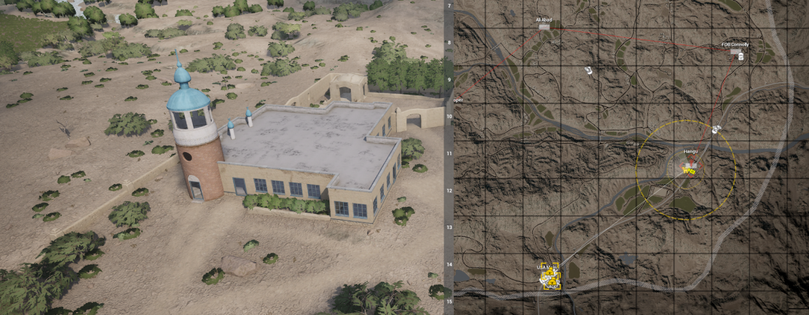
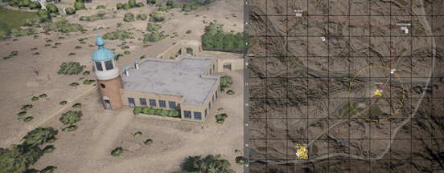
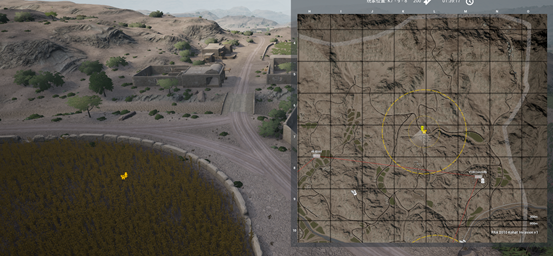

[主页](https://saga2003.github.io/)   -  [Battlefield](https://saga2003.github.io/battlefield.html)   -   [ARMA](https://saga2003.github.io/arma.html)   -   [SQUAD](https://saga2003.github.io/squad.html)   -   [Rainbow6](https://saga2003.github.io/rainbow6.html)   -   [Racing](https://saga2003.github.io/racing.html)   -   [Others](https://saga2003.github.io/others.html)

# SQUAD一命制活动展示

### 活动时间：2022年04月16日

### 活动名：人道主义

### 简报作者：=SAGA=Mr_STP 王老吉

活动日期|活动名称|视角提供者|链接|备注
---|---|---|---|---
2022-04-16|人道主义|=SAGA=EmoB|[网址](https://www.bilibili.com/video/BV1oi4y1U7Sr/)|第三视角【先行版720P】
2022-04-16|人道主义|=SAGA=EmoB|[网址](https://www.bilibili.com/video/BV1ka411v7wp/)|第三视角【4K】
2022-04-16|人道主义|莱特-official|[网址](https://www.bilibili.com/video/BV1EL4y1L7oR/)|第一视角
2022-04-16|人道主义|TommyZhu|[网址](https://www.bilibili.com/video/BV18a411v7BP/)|第一视角
2022-04-16|人道主义|MDKSovieskii|[网址](https://www.bilibili.com/video/BV1wA4y1X7m5/)|第一视角

## 简报（麻匪）
**注：因游戏更新导致模组更新不及时的原因，简报内容与实际任务有些许出入**
[简报原文件](../../file/squad/onelife/20220416/mafei.pdf)

### 任务背景：
中东某地常年遭受战乱，当地民众民不聊生。此地包含各个族派相互征战导致其族内民众连最基本的温饱都难以保证。国际人道主义团队与国际红十字会筹集了一批物资决定帮助此地难民解决温饱，此次物资运送由驻扎在附近的法国维和部队进行护送，因为当地处于交战区所以此次运送任务难度很高随时可能被卷入其中。  

### 任务目标：
1. 维和部队会**按顺序到达4个**城镇后进行粮食发放，为了平民们的温饱我们**需要让他们安全发放2个城镇**后给剩下的粮食抢过来。（**抢夺补给卡**）（**不得摧毁补给卡，全部摧毁则算任务失败，摧毁半数则算险胜**）  
  
  
  
  
2. 不得击杀当地平民（**只有投降兵可举手**）
3. 抢夺卡车后把卡车安全开到**4号城镇**内，然后保护卡车。

### 装备配置：
组长保镖 x 1  
8人标准步兵班 x 8  
重武器班（迫击炮）x 1 弹药（1000）  
机枪皮卡 x 4  
运兵皮卡 x 4  
摩托车 x 10  
防空卡车 x 1  
Bmp炮台皮卡 x 1  
补给皮卡 x 2（700/700）可建造工事但不可建造维修站等武器  
无人机 x 1（**摧毁后不得使用**）  

### 特殊规则：
1. 法军开火原则：被动开火，警戒射击，越线击毙。
2. 城镇内原则：到达城镇后黄色fob内双方允许携带武器进城，但是麻匪军朝维和部队开火，或接近维和部队过近警戒射击后不听劝导执意接近维和部队可解除开火限制。
3. 开火原则：  
   1. 当地方确定麻匪军朝维和部队开火，维和部队解除开火限制。  
   2. 当麻匪军距离维和部队过近警戒射击后不听劝导执意接近时维和部队可解除开火限制。
   3. 当麻匪军载具朝向维和部队行驶过近，维和部队警戒开火麻匪军继续行驶没有停车或者调头时，维和部队解除开火限制  
   4. 综上所述具体距离根据维和部队为主  
**注: 载具不分平民与武装部队之分。**
5.	补充兵规则：麻匪军可在4号城镇黄色FOB圈儿外200米内自行选择放置1个电台2个屯兵所，包含迫击炮（不可紧靠公路）  
6.	此次任务麻匪不得放置地雷，IED全程限制2枚，不可再城镇内交火（FOB内圈内不可开火，可在圈外朝内开火），只可等维和部队驶出城镇后才可开火。  

---

## 简报（法军）
**注：因游戏更新导致模组更新不及时的原因，简报内容与实际任务有些许出入**

### 任务背景
中东某地常年遭受战乱，当地民众民不聊生。此地包含**各个族派**相互征战导致其族内民众连最基本的温饱都难以保证。国际人道主义团队与国际红十字会筹集了**一批物资**决定帮助此地难民解决温饱，此次物资运送由驻扎在附近的法国维和部队进行护送，**因为当地处于交战区所以此次运送任务难度很高随时可能被卷入其中**。 

### 任务目标：
法军维和部队   
1.	**按照顺序**安全护送物资到达各个城镇（放置fob），**保护卡车**。一号城镇在**清真寺内**放置fob后警戒10分钟。  
  

二号城镇在**麦田旁**放置fob后警戒10分钟  

  

三号城镇在**房区内**放置bof后警戒10分钟  

  

四号城镇在**三岔路口**放置bof后警戒10分钟  

  

2.	**不得击杀当地平民**（**只有投降兵可举手**）
3.	非必要尽可能不要卷入当地争斗

### 装备配置：
1. 车队CMD x 1
2. 机械化7人步兵班 x 2
3. 标准8人步兵班 x 6
4. VBL装甲车 x 4
5. AMX-10 RCR装甲突击车 x 1
6. VBCI装甲步兵车 x 2
7. Super Puma x 2
8. 补给卡车 x 4

### 特殊规则：
1.	交战原则：被动开火！被动开火！哪怕人家拿枪对着你你也只能被动开火！此次违规的人发现则禁止参赛一个月！  
2.	城镇内原则：到达城镇后黄色fob内敌人可携枪在城内活动，此时原则除非敌人开火射击我方人员，其余原因禁止开火，可能是当地各族之间的战斗我方保护自己不参与战斗。 
3.	开火原则：
   1. 当确定敌人正在朝我方部队射击（指身边5米内，或载具被击中）后解除开火限制。  
   2. 当敌人步兵接近我方50米内朝敌人脚下10米外警戒射击敌方继续前进者可直接射杀解除开火限制。  
   3. 当敌人可疑载具朝我方驶来可在100米外朝敌人车前方进行警戒射击，警告未过进入50米范围内可直接射杀解除开火限制，如果敌方是重武器我方需给敌人让路避免冲突。  
**注：以上原则不包括直升机，被射击不算在规则内。**  
4.	当地民众：当地民众会以投降兵模型进入，请勿射杀，如果解除开火限制后发现后也不得给予射杀，除非当地民众对我方进行了包含敌意的动作（IED人肉炸弹）等
5.	补充兵规则：当确定与敌阵营交火后开始计时，20分钟后可呼叫一次全阵营复活，全部步兵基地内复活，载具无补充乘坐直升机或步战车入场，突击炮被毁后改为运直，步战车可补充一辆单独入场。

---
**本次活动由PZY提供服务器赞助。对SQUAD丧尸模组感兴趣玩家欢迎前往叙利亚影业服进行游玩。**

[返回一命制](https://saga2003.github.io/squad.html)
[返回主页](https://saga2003.github.io/)